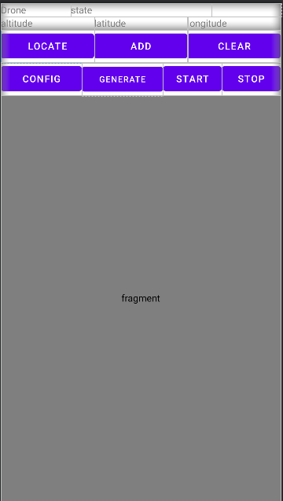
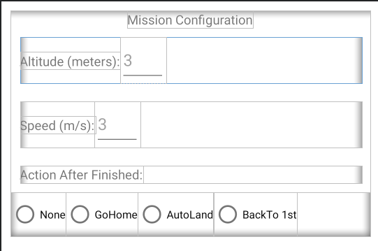

# Creating a MapView Waypoint Application

## PARROT GROUND SDK LAB 3 TUTORIAL KOTLIN

***`WARNING: THIS TUTORIAL ASSUMES YOU'VE COMPLETED THE PREVIOUS TUTORIALS`***

This tutorial is designed for you to gain a basic understanding of the Parrot Ground Sdk. We will implement a mapview and a waypoint flight system for a parrot drone.

You can download the tutorial's final sample project from this [Github Page](https://github.com/godfreynolan/GroundSdkKotlinTutorials).

---

### Preparation

Throughout this tutorial we will be using Android Studio Bumblebee | 2021.1.1. You can download the latest version of Android Studio from here: http://developer.android.com/sdk/index.html.

> Note: In this tutorial, we will use the Sphinx Simulator for testing. However, a physical parrot drone should be capable of working with this code. It is recommended to use the latest version of Android Studio for using this application.

---

### Setting up the Application

#### 1. Create the project

* Open Android Studio and on the start-up screen select **File -> New Project**

* In the **New Project** screen:
* Set the device to **"Phone and Tablet"**.
* Set the template to **"Empty Activity"** and then press **"Next"**.

* On the next screen:
* Set the **Application name** to your desired app name. In this example we will use `Camera`.
* The **Package name** is conventionally set to something like "com.companyName.applicationName". We will use `com.parrot.camera`.
* Set **Language** to Kotlin
* Set **Minimum SDK** to `API 24: Android 7.0 (Nougat)`
* Do **NOT** check the option to "Use legacy android.support.libraries"
* Click **Finish** to create the project.

#### 2. Import Dependencies for Ground Sdk

In the Module gradle for the project, implement the following dependency:

```gradle
    // GroundSdk dependencies
    implementation 'com.parrot.drone.groundsdk:groundsdk:7.0.+'
    runtimeOnly 'com.parrot.drone.groundsdk:arsdkengine:7.0.+'
```

---

### Implementing the MainActivity Class

The `MainActivity.kt` file is created by Android Studio by default. It is used for everything related to connecting, flying, and viewing the drone on a map. By doing this, we are able to set up a waypoint mission system. Let's replace our code with the code in this sample project.

We implement the following features:

1. Connecting to the drone
2. Monitor drone's battery
3. Monitor drone's gps
4. Monitor drone's altitude
5. Monitor drone's state
6. Pilot the drone with a waypoint flight plan

#### 1. Get the Ground Sdk Session

In order to use GroundSdk in your application, you first have to obtain a GroundSdk session at the activity creation. So open your activity file, and add:

```kotlin
class MainActivity : AppCompatActivity() {

    /** GroundSdk instance. */
    private lateinit var groundSdk: GroundSdk

    override fun onCreate(savedInstanceState: Bundle?) {
        super.onCreate(savedInstanceState)
        setContentView(R.layout.activity_main)

        // Get a GroundSdk session.
        groundSdk = ManagedGroundSdk.obtainSession(this)
        // All references taken are linked to the activity lifecycle and
        // automatically closed at its destruction.
    }
}
```

This GroundSdk session keeps and manages all GroundSdk references, according to the Android Activity lifecycle.

#### 2. Connecting the the Drone

To connect to a drone, you should use the AutoConnection facility.

At the Activity start, get the facility and start it.

```kotlin
    override fun onStart() {
        super.onStart()

        // Monitor the auto connection facility.
        groundSdk.getFacility(AutoConnection::class.java) {
            // Called when the auto connection facility is available and when it changes.

            it?.let{
                // Start auto connection.
                if (it.status != AutoConnection.Status.STARTED) {
                    it.start()
                }
            }
        }
    }
```

Auto connection will automatically select and connect the device.

You need to monitor the drone change to stop using the old one and start using the new one.

```kotlin
    // Drone:
    /** Current drone instance. */
    private var drone: Drone? = null

    override fun onStart() {
        super.onStart()

        groundSdk.getFacility(AutoConnection::class.java) {
            it?.let{
                if (it.status != AutoConnection.Status.STARTED) {
                    it.start()
                }
                if (drone?.uid != it.drone?.uid) {
                    stopDroneMonitors()
                    resetDroneUi()

                    drone = it.drone
                    startDroneMonitors()
                }
            }
        }
    }

    /**
     * Starts drone monitors.
     */
    private fun startDroneMonitors() {
    }

    /**
     * Stops drone monitors.
     */
    private fun stopDroneMonitors() {
    }
```

#### 3. Monitoring the Drone & Implementing the MainActivity Layout

Now you will monitor and display the drone connection state and its battery state.

Open the `activity_main.xml` layout file and replace the code with the following:

```xml
<?xml version="1.0" encoding="utf-8"?>
<androidx.constraintlayout.widget.ConstraintLayout xmlns:android="http://schemas.android.com/apk/res/android"
        xmlns:tools="http://schemas.android.com/tools"
        xmlns:app="http://schemas.android.com/apk/res-auto"
        android:layout_width="match_parent"
        android:layout_height="match_parent"
        tools:context=".MainActivity">

    <LinearLayout
        android:id="@+id/linearLayout"
        android:layout_width="match_parent"
        android:layout_height="wrap_content"
        android:orientation="horizontal"
        app:layout_constraintTop_toBottomOf="@+id/info">

        <Button
            android:id="@+id/locate"
            android:layout_width="match_parent"
            android:layout_height="wrap_content"
            android:layout_weight="1"
            android:text="Locate" />

        <Button
            android:id="@+id/add"
            android:layout_width="match_parent"
            android:layout_height="wrap_content"
            android:layout_weight="1"
            android:text="Add" />

        <Button
            android:id="@+id/clear"
            android:layout_width="match_parent"
            android:layout_height="wrap_content"
            android:layout_weight="1"
            android:text="Clear" />
    </LinearLayout>

    <LinearLayout
        android:id="@+id/linearLayout2"
        android:layout_width="match_parent"
        android:layout_height="wrap_content"
        android:orientation="horizontal"
        app:layout_constraintTop_toBottomOf="@+id/linearLayout">

        <Button
            android:id="@+id/config"
            android:layout_width="match_parent"
            android:layout_height="wrap_content"
            android:layout_weight="0.9"
            android:text="Config" />

        <Button
            android:id="@+id/generate"
            android:layout_width="match_parent"
            android:layout_height="wrap_content"
            android:layout_weight="0.9"
            android:text="Generate"
            android:textSize="12sp" />

        <Button
            android:id="@+id/start"
            android:layout_width="match_parent"
            android:layout_height="wrap_content"
            android:layout_weight="1"
            android:text="Start" />

        <Button
            android:id="@+id/stop"
            android:layout_width="match_parent"
            android:layout_height="wrap_content"
            android:layout_weight="1"
            android:text="Stop" />
    </LinearLayout>

    <fragment
        android:id="@+id/map"
        class="com.google.android.gms.maps.SupportMapFragment"
        android:layout_width="match_parent"
        android:layout_height="0dp"
        app:layout_constraintBottom_toBottomOf="parent"
        app:layout_constraintEnd_toEndOf="parent"
        app:layout_constraintStart_toStartOf="parent"
        app:layout_constraintTop_toBottomOf="@+id/linearLayout2" />

    <LinearLayout
            android:id="@+id/info"
            android:layout_width="match_parent"
            android:layout_height="wrap_content"
            android:orientation="vertical"
            app:layout_constraintLeft_toLeftOf="parent"
            app:layout_constraintRight_toRightOf="parent"
            app:layout_constraintTop_toTopOf="parent">

        <LinearLayout
            android:layout_width="match_parent"
            android:layout_height="match_parent"
            android:orientation="horizontal">

            <TextView
                android:id="@+id/labelDroneControl"
                android:layout_width="0dp"
                android:layout_height="match_parent"
                android:layout_weight="1"
                android:text="@string/drone" />

            <TextView
                android:id="@+id/droneStateTxt"
                android:layout_width="0dp"
                android:layout_height="match_parent"
                android:layout_weight="2"
                android:text="@string/state"
                android:textAlignment="center" />

            <TextView
                android:id="@+id/droneBatteryTxt"
                android:layout_width="0dp"
                android:layout_height="match_parent"
                android:layout_weight="1"
                android:text=""
                android:textAlignment="textEnd" />
        </LinearLayout>

        <LinearLayout
                android:layout_width="match_parent"
                android:layout_height="match_parent"
                android:orientation="horizontal">

            <TextView
                android:id="@+id/altitudeTxt"
                android:layout_width="0dp"
                android:layout_height="match_parent"
                android:layout_weight="1"
                android:text="altitude"
                android:textAlignment="textStart" />

            <TextView
                android:id="@+id/labelDroneLat"
                android:layout_width="0dp"
                android:layout_height="match_parent"
                android:layout_weight="1"
                android:text="latitude"
                android:textAlignment="center" />

            <TextView
                    android:id="@+id/labelDroneLng"
                    android:layout_width="0dp"
                    android:layout_height="match_parent"
                    android:layout_weight="1"
                    android:text="longitude"
                    android:textAlignment="textEnd" />
        </LinearLayout>
    </LinearLayout>

</androidx.constraintlayout.widget.ConstraintLayout>
```

Your main activity layout should now look similar to this:

<p align="center">
   
</p>

Now we initialize new text views, mission configuration buttons, and maps in the main activity.

Begin by implementing the following interfaces into the `MainActivity`:

```kotlin
class MainActivity : AppCompatActivity(), OnMapReadyCallback, GoogleMap.OnMapClickListener, View.OnClickListener{
        override fun onClick(v: View?) {}
        override fun onMapReady(googleMap: GoogleMap) {}
        override fun onMapClick(point: LatLng) {}
}
```

Next define and set up the views within the `initUi()` method.

```kotlin
    private lateinit var droneStateTxt: TextView
    private lateinit var droneBatteryTxt: TextView
    private lateinit var latitudeTxt: TextView
    private lateinit var longitudeTxt: TextView
    private lateinit var altitudeTxt: TextView

    // configuration buttons
    private lateinit var locate: Button
    private lateinit var add: Button
    private lateinit var clear: Button
    private lateinit var config: Button
    private lateinit var generate: Button
    private lateinit var start: Button
    private lateinit var stop: Button

    private var droneMarker: Marker? = null
    private var isAdd = false

    private lateinit var mMap: GoogleMap
    private val mMarkers: HashMap<Int, Marker?> = HashMap()

    private fun initUi() {
        latitudeTxt = findViewById(R.id.labelDroneLat)
        longitudeTxt = findViewById(R.id.labelDroneLng)
        altitudeTxt = findViewById(R.id.altitudeTxt)
        droneStateTxt = findViewById(R.id.droneStateTxt)
        droneBatteryTxt = findViewById(R.id.droneBatteryTxt)

        locate = findViewById(R.id.locate)
        add = findViewById(R.id.add)
        clear = findViewById(R.id.clear)
        config = findViewById(R.id.config)
        generate = findViewById(R.id.generate)
        start = findViewById(R.id.start)
        stop = findViewById(R.id.stop)

        locate.setOnClickListener(this)
        add.setOnClickListener(this)
        clear.setOnClickListener(this)
        config.setOnClickListener(this)
        generate.setOnClickListener(this)
        start.setOnClickListener(this)
        stop.setOnClickListener(this)

        start.isEnabled = false
        stop.isEnabled = false
        config.isEnabled = false
        generate.isEnabled = false

        // Obtain the SupportMapFragment and get notified when the map is ready to be used.
        val mapFragment = supportFragmentManager.findFragmentById(R.id.map) as SupportMapFragment
        mapFragment.getMapAsync(this)
    }

    override fun onCreate(savedInstanceState: Bundle?) {
        super.onCreate(savedInstanceState)
        setContentView(R.layout.activity_main)
        initUi()
        droneStateTxt.text = DeviceState.ConnectionState.DISCONNECTED.toString()
        groundSdk = ManagedGroundSdk.obtainSession(this)
    }
```

#### 4. Drone State Monitoring

In order to display the drone connection state, set an observer on the drone state, and get its ConnectionState.

When you have finished with it and you want to stop monitoring it, close the drone state reference.

```kotlin
    // Drone:
    /** Current drone instance. */
    private var drone: Drone? = null
    /** Reference to the current drone state. */
    private var droneStateRef: Ref<DeviceState>? = null

    /**
     * Starts drone monitors.
     */
    private fun startDroneMonitors() {
        // Monitor drone state.
        monitorDroneStates()
    }

    /**
     * Stops drone monitors.
     */
    private fun stopDroneMonitors() {
        // Close all references linked to the current drone to stop their monitoring.

        droneStateRef?.close()
        droneStateRef = null
    }

    /**
     * Monitor current drone state.
     */
    private fun monitorDroneStates() {
        droneStateRef = drone?.getState {
            it?.let {
                droneStateTxt.text = it.connectionState.toString()
                if (it.connectionState == DeviceState.ConnectionState.DISCONNECTED){
                    Toast.makeText(this, "The drone will now return home if in a mission", Toast.LENGTH_SHORT).show()
                }
            }
        }
    }
```

#### 5. Drone GPS and Altitude Monitoring

In order to display the drone's gps, battery, and altitude into their respective text views, set an observer on their states, and start monitoring them.

When you have finished with it and you want to stop monitoring, close their state references.

```kotlin
    private var droneBatteryInfoRef: Ref<BatteryInfo>? = null
    private var droneGPSInfoRef : Ref<Gps>? = null
    private var droneAltitudeInfoRef : Ref<Altimeter>? = null
    
    private fun startDroneMonitors() {
        monitorDroneStates()

        monitorDroneBatteryLevel()
        monitorDroneStates()
        monitorDroneGPS()
        monitorDroneAltitude()
    }

    private fun stopDroneMonitors() {
        droneStateRef?.close()
        droneStateRef = null

        droneBatteryInfoRef?.close()
        droneBatteryInfoRef = null

        droneGPSInfoRef?.close()
        droneGPSInfoRef = null

        droneAltitudeInfoRef?.close()
        droneAltitudeInfoRef = null
    }

    private fun monitorDroneBatteryLevel() {
        droneBatteryInfoRef = drone?.getInstrument(BatteryInfo::class.java) {
            it?.let {
                droneBatteryTxt.text = "${it.batteryLevel} %"
            }
        }
    }

    private fun monitorDroneGPS(){
        droneGPSInfoRef =  drone?.getInstrument(Gps::class.java) { gps ->
            gps?.lastKnownLocation().let { location ->
                ("lng: " + location?.latitude.toString()).also { latitudeTxt.text = it }
                ("lat: " + location?.longitude.toString()).also { longitudeTxt.text = it }
//                Log.d(TAG, "Updated Location: ${it?.latitude}, ${it?.longitude}")
                if (location != null) {
                    updateDroneLocation(location.latitude, location.longitude)
                    cameraUpdate(location.latitude, location.longitude)
                }
            }
        }
    }

    private fun monitorDroneAltitude(){
        droneAltitudeInfoRef =  drone?.getInstrument(Altimeter::class.java) { altimeter ->
            altimeter?.groundRelativeAltitude.let { altitude ->
                ("alt: " + altitude?.value.toString()).also { altitudeTxt.text = it }
            }
        }
    }
```

Finally, implement the following method to reset the connection and battery textviews:

```kotlin
    private fun resetDroneUi() {
        droneStateTxt.text = DeviceState.ConnectionState.DISCONNECTED.toString()
        droneBatteryTxt.text = ""
    }
```

#### 6. Reset Drone User Interface

When you stop monitoring a drone, you have to reset the drone user interface to prevent garbage display.

```kotlin
    override fun onStart() {
        super.onStart()

        groundSdk.getFacility(AutoConnection::class.java) {
            it?.let{
                if (it.status != AutoConnection.Status.STARTED) {
                    it.start()
                }
                if (drone?.uid != it.drone?.uid) {
                    stopDroneMonitors()
                    resetDroneUi()

                    drone = it.drone
                    startDroneMonitors()
                }
            }
        }
    }

    /**
     * Resets drone user interface part.
     */
    private fun resetDroneUi() {
        // Reset drone user interface views.
        droneStateTxt.text = DeviceState.ConnectionState.DISCONNECTED.toString()
        droneBatteryTxt.text = ""
    }
```

#### 7.  Monitoring the Autonomous Flight Plan Pilot

In order to monitor the autonomous flight plan, set an observer on its state and Log any changes in its state.
When you have finished with it and you want to stop monitoring, close their state references.

```kotlin

    private var pilotingItfRef: Ref<ManualCopterPilotingItf>? = null
    private var flightPlanPilotingItfRef: Ref<FlightPlanPilotingItf>? = null

    private fun startDroneMonitors() {
        monitorDroneStates()

        monitorDroneBatteryLevel()
        monitorDroneGPS()
        monitorDroneAltitude()
        monitorPilotingInterface()
    }

    private fun stopDroneMonitors() {
        droneStateRef?.close()
        droneStateRef = null

        droneBatteryInfoRef?.close()
        droneBatteryInfoRef = null

        pilotingItfRef?.close()
        pilotingItfRef = null

        // autonomous pilot
        flightPlanPilotingItfRef?.close()
        flightPlanPilotingItfRef = null

        droneGPSInfoRef?.close()
        droneGPSInfoRef = null

        droneAltitudeInfoRef?.close()
        droneAltitudeInfoRef = null
    }

    private fun monitorPilotingInterface() {
        // autonomous piloting
        flightPlanPilotingItfRef = drone?.getPilotingItf(FlightPlanPilotingItf::class.java){
            if (it != null){
                manageAutoPilotingItfState(it)
            }
        }
    }

    private fun manageAutoPilotingItfState(itf: FlightPlanPilotingItf) {
        when (itf.state) {
            Activable.State.UNAVAILABLE -> {
                Log.d(TAG, "the state is unavailable")
            }
            Activable.State.IDLE -> {
                Log.d(TAG, "activation status: $status - state is idle")
            }

            Activable.State.ACTIVE -> {
                Log.d(TAG, "state is active")
            }

        }
    }
```

Now, start implementing the onClick functions for each button along with the functions themselves. Each button's function is self explanatory but we will describe each one.

```kotlin
    override fun onClick(v: View?) {
        when (v?.id) {
            R.id.locate -> { // will draw the drone and move camera to the position of the drone on the map
                val location =  drone?.getInstrument(Gps::class.java)?.lastKnownLocation()
                latitudeTxt.text = location?.latitude.toString()
                longitudeTxt.text = location?.longitude.toString()
                Log.d(TAG, "Location on Btn Click: ${location?.latitude}, ${location?.longitude}")
                if (location != null) {
                    updateDroneLocation(location.latitude, location.longitude)
                    cameraUpdate(location.latitude, location.longitude)
                }
            }
            R.id.add -> { // this will toggle the adding of the waypoints
                enableDisableAdd()
            }
            R.id.clear -> { // clear the waypoints on the map
                runOnUiThread {
                    mMap.clear()
                    clearMission()
                }
            }
            R.id.config -> { // this will show the settings
                showSettingsDialog()
            }
            R.id.generate -> { // this will upload the mission to the drone so that it can execute it
                generateMission()
            }
            R.id.start -> { // this will let the drone start navigating to the waypoints
                startMission()
            }
            R.id.stop -> { // this will immediately stop the waypoint mission
                stopMission()
            } else -> {}
        }
    }
```

The locate button is used to `locate` the drone's current position on the screen. In order to do this, the map must be set up first. Afterwards, when it is clicked, the `updateDroneLocation()` method is called which will locate the aircraft on the map and pan there. Additionally, it will also update the location text views when clicked as well.

```kotlin

    private fun updateDroneLocation(latitude: Double, longitude: Double) { // this will draw the aircraft as it moves
        if (latitude.isNaN() || longitude.isNaN())  { return }

        val pos = LatLng(latitude, longitude)
        // the following will draw the aircraft on the screen
        val markerOptions = MarkerOptions()
            .position(pos)
            .icon(BitmapDescriptorFactory.fromResource(R.drawable.aircraft))
        runOnUiThread {
            droneMarker?.remove()
            if (checkGpsCoordination(latitude, longitude)) {
                droneMarker = mMap.addMarker(markerOptions)
            }
        }
    }

    private fun checkGpsCoordination(latitude: Double, longitude: Double): Boolean { // this will check if your gps coordinates are valid
        return latitude > -90 && latitude < 90 && longitude > -180 && longitude < 180 && latitude != 0.0 && longitude != 0.0
    }

    private fun setUpMap() {
        mMap.setOnMapClickListener(this) // add the listener for click for amap object
    }


    //pans the camera to a location coordinate on the map
    private fun cameraUpdate(latitude: Double, longitude: Double) {
        val pos = LatLng(latitude, longitude)
        val zoomLevel = 18.0.toFloat()
        val cu = CameraUpdateFactory.newLatLngZoom(pos, zoomLevel)
        mMap.moveCamera(cu)
    }

    override fun onMapReady(googleMap: GoogleMap) {
        mMap = googleMap
        setUpMap()
    }
```

The next button is used to `add` waypoints to the map in order to set up a mission. All the variables and functions below must be implemented for the rest of the buttons to work. Now, as long as this button is enabled, a waypoint will be added to the waypoint list everytime the map is clicked.

```kotlin

    private var droneMarker: Marker? = null
    private var isAdd = false

    private lateinit var mMap: GoogleMap
    private val mMarkers: HashMap<Int, Marker?> = HashMap()
    private lateinit var mavlinkFile : File

    //mission settings
    private val missionList = mutableListOf<MavlinkCommand>()
    private val waypointList = mutableListOf<LatLng>()
    private var mAltitude : Double = 100.0
    private var mSpeed : Double = 10.0
    private var mFinishedAction :String = "gohome"

    private fun enableDisableAdd() { // toggle for adding or not
        if (!isAdd) {
            isAdd = true
            add.text = "Exit"
            config.isEnabled = false
        } else {
            isAdd = false
            add.text = "Add"
            config.isEnabled = true
        }
    }

    override fun onMapClick(point: LatLng) {
        if (isAdd) {
            markWaypoint(point)
            waypointList.add(point)
//            val mWaypoint = NavigateToWaypointCommand(point.latitude, point.longitude, mAltitude,0.0, Companion.DEFAULT_HOLD_TIME, Companion.DEFAULT_ACCEPTANCE_RADIUS)
//            missionList.add(mWaypoint)
        } else {
            Toast.makeText(this, "Cannot Add Waypoint", Toast.LENGTH_SHORT).show()
        }
    }

    private fun markWaypoint(point: LatLng) {
        //Create MarkerOptions object
        val markerOptions = MarkerOptions()
        markerOptions.position(point)
        markerOptions.icon(BitmapDescriptorFactory.defaultMarker(BitmapDescriptorFactory.HUE_BLUE))
        val marker: Marker? = mMap.addMarker(markerOptions)
        mMarkers[mMarkers.size] = marker
    }

```

The next button is used to `clear` the map and the waypoints that were put on it. Implement this method.

```kotlin
    private fun clearMission(){
        Toast.makeText(this, "Cleared the current mission. Please recreate it again...", Toast.LENGTH_SHORT).show()
        missionList.clear()
        waypointList.clear()
        config.isEnabled = false
        start.isEnabled = false
        generate.isEnabled = false
        stop.isEnabled = false
    }
```

The next button is used to `configure` a waypoint mission flight plan given the waypoint list. Begin by creating a layout for this configuration dialog and then create the dialog function itself.

```xml
<?xml version="1.0" encoding="utf-8"?>
<LinearLayout xmlns:android="http://schemas.android.com/apk/res/android"
    android:layout_width="match_parent"
    android:layout_height="wrap_content"
    android:orientation="vertical"
    android:layout_marginBottom="10dp"
    android:layout_marginTop="10dp"
    android:layout_marginLeft="10dp"
    android:layout_marginRight="10dp">

    <TextView
        android:layout_width="wrap_content"
        android:layout_height="wrap_content"
        android:layout_gravity="center_horizontal"
        android:text="Mission Configuration"></TextView>

    <LinearLayout
        android:layout_width="match_parent"
        android:layout_height="wrap_content"
        android:orientation="horizontal"
        android:layout_marginBottom="10dp"
        android:layout_marginTop="10dp"
        android:layout_marginLeft="10dp"
        android:layout_marginRight="10dp">

        <TextView
            android:layout_width="wrap_content"
            android:layout_height="wrap_content"
            android:text="Altitude (meters):"></TextView>

        <EditText
            android:id="@+id/altitude"
            android:layout_width="50dp"
            android:layout_height="50dp"
            android:hint="3"
            android:textAlignment="center"></EditText>
    </LinearLayout>

    <LinearLayout
        android:layout_width="match_parent"
        android:layout_height="match_parent"
        android:layout_marginLeft="10dp"
        android:layout_marginTop="10dp"
        android:layout_marginRight="10dp"
        android:layout_marginBottom="10dp"
        android:orientation="horizontal">

        <TextView
            android:layout_width="wrap_content"
            android:layout_height="wrap_content"
            android:text="Speed (m/s):"></TextView>

        <EditText
            android:id="@+id/speed"
            android:layout_width="50dp"
            android:layout_height="50dp"
            android:hint="3"
            android:textAlignment="center"></EditText>
    </LinearLayout>

    <LinearLayout
        android:layout_width="match_parent"
        android:layout_height="wrap_content"
        android:orientation="horizontal"
        android:layout_marginBottom="10dp"
        android:layout_marginTop="10dp"
        android:layout_marginLeft="10dp"
        android:layout_marginRight="10dp">
        <TextView
            android:layout_width="wrap_content"
            android:layout_height="wrap_content"
            android:text="Action After Finished:"/>
    </LinearLayout>

    <LinearLayout
        android:layout_width="match_parent"
        android:layout_height="wrap_content"
        android:orientation="horizontal" >
        <RadioGroup
            android:layout_width="wrap_content"
            android:layout_height="wrap_content"
            android:orientation="horizontal"
            android:id="@+id/actionAfterFinished"
            android:layout_gravity="center_horizontal">
            <RadioButton
                android:id="@+id/finishNone"
                android:layout_width="wrap_content"
                android:layout_height="wrap_content"
                android:textSize="5pt"
                android:text="None"/>
            <RadioButton
                android:id="@+id/finishGoHome"
                android:layout_width="wrap_content"
                android:layout_height="wrap_content"
                android:textSize="5pt"
                android:text="GoHome"/>
            <RadioButton
                android:id="@+id/finishAutoLanding"
                android:layout_width="wrap_content"
                android:layout_height="wrap_content"
                android:textSize="5pt"
                android:text="AutoLand"/>
            <RadioButton
                android:id="@+id/finishToFirst"
                android:layout_width="wrap_content"
                android:layout_height="wrap_content"
                android:textSize="5pt"
                android:text="BackTo 1st"/>
        </RadioGroup>
    </LinearLayout>

</LinearLayout>

```

Now, create the dialog method that will be used to configure the mission settings.

```kotlin
    private fun showSettingsDialog() {
        val wayPointSettings = layoutInflater.inflate(R.layout.dialog_waypointsetting, null) as LinearLayout

        val altitudeEditText = wayPointSettings.findViewById<View>(R.id.altitude) as EditText

        val speedEditText = wayPointSettings.findViewById<View>(R.id.speed) as EditText

        val actionAfterFinishedRG = wayPointSettings.findViewById<View>(R.id.actionAfterFinished) as RadioGroup
        actionAfterFinishedRG.setOnCheckedChangeListener { _, checkedId -> // set the action after finishing the mission
            Log.d(TAG, "Select finish action")

            when (checkedId) {
                R.id.finishNone -> {
                    mFinishedAction = "none"
                }
                R.id.finishGoHome -> {
                    mFinishedAction = "gohome"
                }
                R.id.finishAutoLanding -> {
                    mFinishedAction = "autoland"
                }
                R.id.finishToFirst -> {
                    mFinishedAction = "firstwaypoint"
                }
            }
        }

        AlertDialog.Builder(this) // creates the dialog
            .setTitle("")
            .setView(wayPointSettings)
            .setPositiveButton("Finish") { dialog, id ->
                mAltitude = altitudeEditText.text.toString().toDouble()
                mSpeed = speedEditText.text.toString().toDouble()
                Log.e(TAG, "altitude $mAltitude")
                Log.e(TAG, "speed $mSpeed")
                Log.e(TAG, "mFinishedAction $mFinishedAction")
                generate.isEnabled = true
                Toast.makeText(this, "Finished configuring mission settings", Toast.LENGTH_SHORT).show()
            }
            .setNegativeButton("Cancel") { dialog, id -> dialog.cancel() }
            .create()
            .show()
    }
```

It should look similar to this:

<p align="center">
   
</p>

The next button is responsible for `generating` the mission and saving it as a mavlink file. The method below takes in all the waypoints in the waypoint list and all the configuration settings and then creates a sequential flight plan with it. Implement the following method:

```kotlin
    private fun generateMission(){
        Toast.makeText(this, "Generating mavlink mission file...", Toast.LENGTH_SHORT).show()

        val location =  drone?.getInstrument(Gps::class.java)?.lastKnownLocation()

        missionList.add(0, ChangeSpeedCommand(ChangeSpeedCommand.SpeedType.GROUND_SPEED, mSpeed, false))

        if (location != null){
            when (mFinishedAction) {
                "gohome" -> {
                    missionList.add(1, TakeOffCommand(location.latitude, location.longitude, 0.0,0.0))
                    waypointList.forEach{ point ->
                        missionList.add(
                            NavigateToWaypointCommand(
                                point.latitude, point.longitude, mAltitude,0.0, Companion.DEFAULT_HOLD_TIME, Companion.DEFAULT_ACCEPTANCE_RADIUS
                            )
                        )
                    }
                    missionList.add(ReturnToLaunchCommand())
                    missionList.add(LandCommand(location.latitude, location.longitude, 0.0,0.0))
                }
                "autoland" -> {
                    missionList.add(1, TakeOffCommand(location.latitude, location.longitude, 0.0,0.0))
                    waypointList.forEach{ point ->
                        missionList.add(
                            NavigateToWaypointCommand(
                                point.latitude, point.longitude, mAltitude,0.0, Companion.DEFAULT_HOLD_TIME, Companion.DEFAULT_ACCEPTANCE_RADIUS
                            )
                        )
                    }
                    missionList.add(LandCommand(location.latitude, location.longitude, 0.0,0.0))
                }
                "none" -> {
                    missionList.add(1, TakeOffCommand(location.latitude, location.longitude, 0.0,0.0))
                    waypointList.forEach{ point ->
                        missionList.add(
                            NavigateToWaypointCommand(
                                point.latitude, point.longitude, mAltitude,0.0, Companion.DEFAULT_HOLD_TIME, Companion.DEFAULT_ACCEPTANCE_RADIUS
                            )
                        )
                    }
                }
                "firstwaypoint" -> {
                    missionList.add(1, TakeOffCommand(location.latitude, location.longitude, 0.0,0.0))
                    waypointList.forEach{ point ->
                        missionList.add(
                            NavigateToWaypointCommand(
                                point.latitude, point.longitude, mAltitude,0.0, Companion.DEFAULT_HOLD_TIME, Companion.DEFAULT_ACCEPTANCE_RADIUS
                            )
                        )
                    }
                    missionList.add(missionList[2])
                    missionList.add(LandCommand(location.latitude, location.longitude, 0.0,0.0))
                }
            }
        }

        val folder = getExternalFilesDir("flight_plan")
        mavlinkFile = File(folder, "flight_plan.txt")

        MavlinkFiles.generate(
            mavlinkFile,
            missionList,
            "QGC WPL 120"
        )
        start.isEnabled = true
        stop.isEnabled = true
    }
```

The `start mission` button starts the mission while the flight plan monitor is currently idle and uploads it to the drone. Implement the following:

```kotlin
    private fun startMission() {
        val missionControl = drone?.getPilotingItf(FlightPlanPilotingItf::class.java)
        if (missionControl != null){
            missionControl.clearRecoveryInfo()
            Log.d(TAG, mavlinkFile.absolutePath)
            missionControl.uploadFlightPlan(mavlinkFile)
            missionControl.returnHomeOnDisconnect.isEnabled = true
            Log.d(TAG,  "latest mission: " + missionControl.latestMissionItemExecuted.toString())
            Log.d(TAG,  "it.returnHomeOnDisconnect: " + missionControl.returnHomeOnDisconnect.isEnabled.toString())
            if(missionControl.state == Activable.State.IDLE){
                val missionStarted = missionControl.activate(true)
                if (missionStarted){
                    Toast.makeText(this, "mission started", Toast.LENGTH_SHORT).show()
                }else{
                    Toast.makeText(this, "mission couldn't be started", Toast.LENGTH_SHORT).show()
                }
            }
        }
    }
```

Finally, the `stop mission` button stops the mission and the drone is left hovering where it last was. The pilot can then manually fly the drone back the home point.

```kotlin

    private fun stopMission(){
        val missionControl = drone?.getPilotingItf(FlightPlanPilotingItf::class.java)
        val isStopped = missionControl?.stop()
        if (isStopped == true){
            Toast.makeText(this, "mission has been stopped", Toast.LENGTH_SHORT).show()
        }else{
            Toast.makeText(this, "mission couldn't be stopped", Toast.LENGTH_SHORT).show()
        }
        Log.d(TAG, "mission is stopped = $isStopped")
    }
```

---

### App Demo

https://user-images.githubusercontent.com/33791954/165952189-2750d15b-a633-4713-bf6d-9975d501428c.mp4

---

### Summary

To conclude, you have gotten a basic understanding of the Parrot Ground Sdk's Flight Plan system. We implemented a mapview and a waypoint flight system for a parrot drone. Thank you for following this!

---

### License

MIT
