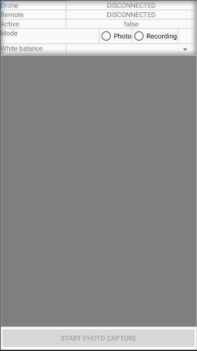
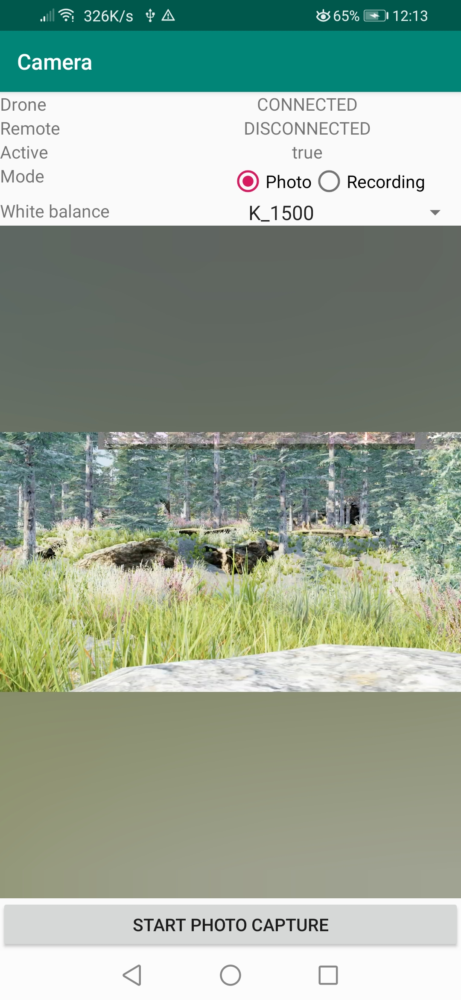

# Creating a Camera Application
## PARROT GROUND SDK LAB 2 TUTORIAL KOTLIN

***`WARNING: THIS TUTORIAL ASSUMES YOU'VE COMPLETED THE PREVIOUS TUTORIALS`***

This tutorial is designed for you to gain a basic understanding of the Parrot Ground Sdk. It will implement the FPV view and two basic camera functionalities: Take Photo and Record video.

You can download the tutorial's final sample project from this [Github Page](https://github.com/riisinterns/GroundSdkKotlinTutorials).

---
### Preparation
Throughout this tutorial we will be using Android Studio Bumblebee | 2021.1.1. You can download the latest version of Android Studio from here: http://developer.android.com/sdk/index.html.

> Note: In this tutorial, we will use the Sphinx Simulator for testing. However, a physical parrot drone should be capable of working with this code. It is recommended to use the latest version of Android Studio for using this application.

---
### Setting up the Application

#### 1. Create the project

*   Open Android Studio and on the start-up screen select **File -> New Project**

*   In the **New Project** screen:
    *   Set the device to **"Phone and Tablet"**.
    *   Set the template to **"Empty Activity"** and then press **"Next"**.

*   On the next screen:
    * Set the **Application name** to your desired app name. In this example we will use `Camera`.
    * The **Package name** is conventionally set to something like "com.companyName.applicationName". We will use `com.parrot.camera`.
    * Set **Language** to Kotlin
    * Set **Minimum SDK** to `API 24: Android 7.0 (Nougat)`
    * Do **NOT** check the option to "Use legacy android.support.libraries"
    * Click **Finish** to create the project.

#### 2. Import Dependencies for Ground Sdk

In the Module gradle for the project, implement the following dependency:

```gradle
    // GroundSdk dependencies
    implementation 'com.parrot.drone.groundsdk:groundsdk:7.0.+'
    runtimeOnly 'com.parrot.drone.groundsdk:arsdkengine:7.0.+'
```

---
### Implementing the MainActivity Class

The `MainActivity.kt` file is created by Android Studio by default. It is used to manage the connection to the drone, the streaming view and uses delegates to control the camera user interface. Let's replace its code within the sample project.

In the code shown above, we implement the following features:

1. ActiveState: sample code to display the active state of a camera
2. CameraMode: sample code to display and change the camera mode (photo capture or video recording)
3. StartStop: sample code to manage a button to start/stop photo capture and video recording
4. WhiteBalanceTemperature: sample code to display and change custom white balance temperature

#### 1. Get the Ground Sdk Session

In order to use GroundSdk in your application, you first have to obtain a GroundSdk session at the activity creation. So open your activity file, and add:

```kotlin
class MainActivity : AppCompatActivity() {

    /** GroundSdk instance. */
    private lateinit var groundSdk: GroundSdk

    override fun onCreate(savedInstanceState: Bundle?) {
        super.onCreate(savedInstanceState)
        setContentView(R.layout.activity_main)

        // Get a GroundSdk session.
        groundSdk = ManagedGroundSdk.obtainSession(this)
        // All references taken are linked to the activity lifecycle and
        // automatically closed at its destruction.
    }
}
```

This GroundSdk session keeps and manages all GroundSdk references, according to the Android Activity lifecycle.

#### 2. Connecting the the Drone

To connect to a drone, you should use the AutoConnection facility.

At the Activity start, get the facility and start it.

```kotlin
    override fun onStart() {
        super.onStart()

        // Monitor the auto connection facility.
        groundSdk.getFacility(AutoConnection::class.java) {
            // Called when the auto connection facility is available and when it changes.

            it?.let{
                // Start auto connection.
                if (it.status != AutoConnection.Status.STARTED) {
                    it.start()
                }
            }
        }
    }
```

Auto connection will automatically select and connect the device.

You need to monitor the drone change to stop using the old one and start using the new one.

```kotlin
    // Drone:
    /** Current drone instance. */
    private var drone: Drone? = null

    override fun onStart() {
        super.onStart()

        // Monitor the auto connection facility.
        groundSdk.getFacility(AutoConnection::class.java) {
            // Called when the auto connection facility is available and when it changes.

            it?.let{
                // Start auto connection.
                if (it.status != AutoConnection.Status.STARTED) {
                    it.start()
                }

                // If the drone has changed.
                if (drone?.uid != it.drone?.uid) {
                    if(drone != null) {
                        // Stop monitoring the old drone.
                        stopDroneMonitors()
                    }

                    // Monitor the new drone.
                    drone = it.drone
                    if(drone != null) {
                        startDroneMonitors()
                    }
                }
            }
        }
    }

    /**
     * Starts drone monitors.
     */
    private fun startDroneMonitors() {
    }

    /**
     * Stops drone monitors.
     */
    private fun stopDroneMonitors() {
    }
```

#### 3. Monitoring the Drone & Implementing the MainActivity Layout

Now you will monitor and display the drone connection state and its battery state.

Open the `activity_main.xml` layout file and replace the code with the following:

```xml
<?xml version="1.0" encoding="utf-8"?>
<androidx.constraintlayout.widget.ConstraintLayout xmlns:android="http://schemas.android.com/apk/res/android"
    xmlns:app="http://schemas.android.com/apk/res-auto"
    xmlns:tools="http://schemas.android.com/tools"
    android:layout_width="match_parent"
    android:layout_height="match_parent"
    tools:context=".MainActivity">

    <LinearLayout
        android:id="@+id/info"
        android:layout_width="match_parent"
        android:layout_height="wrap_content"
        android:orientation="vertical"
        app:layout_constraintLeft_toLeftOf="parent"
        app:layout_constraintRight_toRightOf="parent"
        app:layout_constraintTop_toTopOf="parent">

        <LinearLayout
            android:layout_width="match_parent"
            android:layout_height="match_parent"
            android:orientation="horizontal">

            <TextView
                android:layout_width="0dp"
                android:layout_height="match_parent"
                android:layout_weight="1"
                android:text="@string/drone"/>

            <TextView
                android:id="@+id/droneStateTxt"
                android:layout_width="0dp"
                android:layout_height="match_parent"
                android:layout_weight="2"
                tools:text="DISCONNECTED"
                android:textAlignment="center"/>
        </LinearLayout>

        <LinearLayout
            android:layout_width="match_parent"
            android:layout_height="match_parent"
            android:orientation="horizontal">

            <TextView
                android:layout_width="0dp"
                android:layout_height="match_parent"
                android:layout_weight="1"
                android:text="@string/remote"/>

            <TextView
                android:id="@+id/rcStateTxt"
                android:layout_width="0dp"
                android:layout_height="match_parent"
                android:layout_weight="2"
                tools:text="DISCONNECTED"
                android:textAlignment="center"/>
        </LinearLayout>

        <LinearLayout
            android:layout_width="match_parent"
            android:layout_height="match_parent"
            android:orientation="horizontal">

            <TextView
                android:layout_width="0dp"
                android:layout_height="match_parent"
                android:layout_weight="1"
                android:text="@string/active"/>

            <TextView
                android:id="@+id/activeTxt"
                android:layout_width="0dp"
                android:layout_height="match_parent"
                android:layout_weight="2"
                tools:text="false"
                android:textAlignment="center"/>
        </LinearLayout>

        <LinearLayout
            android:layout_width="match_parent"
            android:layout_height="match_parent"
            android:orientation="horizontal">

            <TextView
                android:layout_width="0dp"
                android:layout_height="match_parent"
                android:layout_weight="1"
                android:text="@string/mode"/>

            <RadioGroup
                android:layout_width="0dp"
                android:layout_height="wrap_content"
                android:layout_weight="1"
                android:orientation="horizontal">

                <RadioButton android:id="@+id/photoMode"
                    android:layout_width="wrap_content"
                    android:layout_height="wrap_content"
                    android:text="@string/photo"/>

                <RadioButton android:id="@+id/recordingMode"
                    android:layout_width="wrap_content"
                    android:layout_height="wrap_content"
                    android:text="@string/recording"/>
            </RadioGroup>
        </LinearLayout>

        <LinearLayout
            android:layout_width="match_parent"
            android:layout_height="match_parent"
            android:orientation="horizontal">

            <TextView
                android:layout_width="0dp"
                android:layout_height="match_parent"
                android:layout_weight="1"
                android:text="@string/white_balance_temperature"/>

            <Spinner
                android:id="@+id/whiteBalanceSpinner"
                android:layout_width="0dp"
                android:layout_height="wrap_content"
                android:layout_weight="2"
                android:textAlignment="center"/>
        </LinearLayout>
    </LinearLayout>

    <com.parrot.drone.groundsdk.stream.GsdkStreamView
        android:id="@+id/stream_view"
        android:layout_width="match_parent"
        android:layout_height="0dp"
        app:layout_constraintTop_toBottomOf="@id/info"
        app:layout_constraintBottom_toTopOf="@id/startStopBtn"
        tools:layout_editor_absoluteY="38dp">
    </com.parrot.drone.groundsdk.stream.GsdkStreamView>

    <Button
        android:id="@+id/startStopBtn"
        android:layout_width="match_parent"
        android:layout_height="wrap_content"
        android:enabled="false"
        android:text="@string/start_photo"
        app:layout_constraintBottom_toBottomOf="parent"/>

</androidx.constraintlayout.widget.ConstraintLayout>
```

Also, go to `strings.xml` and add the following strings:

```xml
<resources>
    <string name="app_name">Camera</string>
    <string name="drone">Drone</string>
    <string name="remote">Remote</string>
    <string name="active">Active</string>
    <string name="mode">Mode</string>
    <string name="photo">Photo</string>
    <string name="recording">Recording</string>
    <string name="white_balance_temperature">White balance temperature</string>
    <string name="unavailable">Unavailable</string>
    <string name="start_photo">Start photo capture</string>
    <string name="stop_photo">Stop photo capture</string>
    <string name="start_recording">Start recording</string>
    <string name="stop_recording">Stop recording</string>
</resources>
```

Your main activity layout should now look similar to this:

<p align="center">
   
</p>

Now we initialize new text views and stream views in the main activity.

```kotlin
    // User interface:
    /** Video stream view. */
    private val streamView by lazy { findViewById<GsdkStreamView>(R.id.stream_view) }
    /** Drone state text view. */
    private val droneStateTxt by lazy { findViewById<TextView>(R.id.droneStateTxt) }
    /** Remote state text view. */
    private val rcStateTxt by lazy { findViewById<TextView>(R.id.rcStateTxt) }

    override fun onCreate(savedInstanceState: Bundle?) {
        super.onCreate(savedInstanceState)
        setContentView(R.layout.activity_main)
    
        // Initialize user interface default values.
        droneStateTxt.text = DeviceState.ConnectionState.DISCONNECTED.toString()
        rcStateTxt.text = DeviceState.ConnectionState.DISCONNECTED.toString()
    
        streamView.paddingFill = PADDING_FILL_BLUR_CROP
    
        // Get a GroundSdk session.
        groundSdk = ManagedGroundSdk.obtainSession(this)
        // All references taken are linked to the activity lifecycle and
        // automatically closed at its destruction.
    }
```

#### 4. Drone State Monitoring

In order to display the drone connection state, set an observer on the drone state, and get its ConnectionState.

When you have finished with it and you want to stop monitoring it, close the drone state reference.

```kotlin
    // Drone:
    /** Current drone instance. */
    private var drone: Drone? = null
    /** Reference to the current drone state. */
    private var droneStateRef: Ref<DeviceState>? = null

    /**
     * Starts drone monitors.
     */
    private fun startDroneMonitors() {
        // Monitor drone state.
        monitorDroneState()
    }

    /**
     * Stops drone monitors.
     */
    private fun stopDroneMonitors() {
        // Close all references linked to the current drone to stop their monitoring.

        droneStateRef?.close()
        droneStateRef = null
    }

    /**
     * Monitor current drone state.
     */
    private fun monitorDroneState() {
        // Monitor current drone state.
        droneStateRef = drone?.getState {
            // Called at each drone state update.

            it?.let {
                // Update drone connection state view.
                droneStateTxt.text = it.connectionState.toString()
            }
        }
    }
```

#### 5. Drone Live Stream Monitoring

In order to display the drone's live stream, first create a method called `startVideoStream()` and set an observer to monitor the stream server.
Also, remember to define the reference variables to the live stream and the stream server.

```kotlin
    /** Reference to the current drone stream server Peripheral. */
    private var streamServerRef: Ref<StreamServer>? = null
    /** Reference to the current drone live stream. */
    private var liveStreamRef: Ref<CameraLive>? = null
    /** Current drone live stream. */
    private var liveStream: CameraLive? = null
    
    /**
     * Starts the video stream.
     */
    private fun startVideoStream() {
        // Monitor the stream server.
        streamServerRef = drone?.getPeripheral(StreamServer::class.java) { streamServer ->
            // Called when the stream server is available and when it changes.

            streamServer?.run {
                // Enable Streaming
                if(!streamingEnabled()) {
                    enableStreaming(true)
                }

                // Monitor the live stream.
                if (liveStreamRef == null) {
                    liveStreamRef = live { stream ->
                        // Called when the live stream is available and when it changes.

                        if (stream != null) {
                            if (liveStream == null) {
                                // It is a new live stream.

                                // Set the live stream as the stream
                                // to be render by the stream view.
                                streamView.setStream(stream)
                            }

                            // Play the live stream.
                            if (stream.playState() != CameraLive.PlayState.PLAYING) {
                                stream.play()
                            }
                        } else {
                            // Stop rendering the stream
                            streamView.setStream(null)
                        }
                        // Keep the live stream to know if it is a new one or not.
                        liveStream = stream
                    }
                }
            } ?: run {
                // Stop monitoring the live stream
                liveStreamRef?.close()
                liveStreamRef = null
                // Stop rendering the stream
                streamView.setStream(null)
            }
        }
    }
```

In the code above, we get the stream server peripheral and an observer is registered that is responsible for detecting changes to the stream server.

By accessing the `streamServer`, we are able to run various methods native to the StreamServer. If the `streamServer` turns out to be null, we stop monitoring the live stream and stop rendering the stream. Whereas, if it isn't null, we enable, monitor, and play the drone's live stream onto the streamview.

Finally, implement everything in the following methods:

```kotlin
    /**
     * Resets drone user interface part.
     */
    private fun resetDroneUi() {
        // Reset drone user interface views.
        droneStateTxt.text = DeviceState.ConnectionState.DISCONNECTED.toString()

        // Stop rendering the stream.
        streamView.setStream(null)
    }

    /**
     * Starts drone monitors.
     */
    private fun startDroneMonitors() {
        // Monitor drone state.
        monitorDroneState()

        // Start video stream.
        startVideoStream()
    }

    /**
     * Stops drone monitors.
     */
    private fun stopDroneMonitors() {
        // Close all references linked to the current drone to stop their monitoring.

        droneStateRef?.close()
        droneStateRef = null

        liveStreamRef?.close()
        liveStreamRef = null

        streamServerRef?.close()
        streamServerRef = null

        liveStream = null
    }
```

#### 6. Reset Drone User Interface

When you stop monitoring a drone, you have to reset the drone user interface to prevent garbage display.

```kotlin
    override fun onStart() {
        super.onStart()

        // Monitor the auto connection facility.
        groundSdk.getFacility(AutoConnection::class.java) {
            // Called when the auto connection facility is available and when it changes.

            it?.let{
                // Start auto connection.
                if (it.status != AutoConnection.Status.STARTED) {
                    it.start()
                }

                // If the drone has changed.
                if (drone?.uid != it.drone?.uid) {
                    if(drone != null) {
                        // Stop monitoring the old drone.
                        stopDroneMonitors()

                        // Reset user interface drone part.
                        resetDroneUi()
                    }

                    // Monitor the new drone.
                    drone = it.drone
                    if(drone != null) {
                        startDroneMonitors()
                    }
                }

            }
        }
    }

    /**
     * Resets drone user interface part.
     */
    private fun resetDroneUi() {
        // Reset drone user interface views.
        droneStateTxt.text = DeviceState.ConnectionState.DISCONNECTED.toString()
        droneBatteryTxt.text = ""
    }
```


#### 7.  Implementing the Remote Control

We will see how to connect to a remote control and display its connection state. We can use the auto connection facility as with the drone, and get the remote control from it.

```kotlin
    // Remote control:
/** Current remote control instance. */
private var rc: RemoteControl? = null

override fun onStart() {
    super.onStart()

    // Monitor the auto connection facility.
    groundSdk.getFacility(AutoConnection::class.java) {
        // Called when the auto connection facility is available and when it changes.

        it?.let{
            // Start auto connection.
            if (it.status != AutoConnection.Status.STARTED) {
                it.start()
            }

            // If the drone has changed.
            if (drone?.uid != it.drone?.uid) {
                if(drone != null) {
                    // Stop monitoring the old drone.
                    stopDroneMonitors()

                    // Reset user interface drone part.
                    resetDroneUi()
                }

                // Monitor the new drone.
                drone = it.drone
                if(drone != null) {
                    startDroneMonitors()
                }
            }

            // If the remote control has changed.
            if (rc?.uid  != it.remoteControl?.uid) {
                if(rc != null) {
                    // Stop monitoring the old remote.
                    stopRcMonitors()

                    // Reset user interface Remote part.
                    resetRcUi()
                }

                // Monitor the new remote.
                rc = it.remoteControl
                if(rc != null) {
                    startRcMonitors()
                }
            }
        }
    }
}

/**
 * Resets remote user interface part.
 */
private fun resetRcUi() {
}

/**
 * Starts remote control monitors.
 */
private fun startRcMonitors() {
}

/**
 * Stops remote control monitors.
 */
private fun stopRcMonitors() {
}
```
Then get, initialize and reset this new text views in your activity.

```kotlin
    // User interface:
    /** Video stream view. */
    private val streamView by lazy { findViewById<GsdkStreamView>(R.id.stream_view) }
    /** Drone state text view. */
    private val droneStateTxt by lazy { findViewById<TextView>(R.id.droneStateTxt) }
    /** Remote state text view. */
    private val rcStateTxt by lazy { findViewById<TextView>(R.id.rcStateTxt) }

    override fun onCreate(savedInstanceState: Bundle?) {
        super.onCreate(savedInstanceState)
        setContentView(R.layout.activity_main)
    
        // Initialize user interface default values.
        droneStateTxt.text = DeviceState.ConnectionState.DISCONNECTED.toString()
        rcStateTxt.text = DeviceState.ConnectionState.DISCONNECTED.toString()
    
        streamView.paddingFill = PADDING_FILL_BLUR_CROP
    
        // Get a GroundSdk session.
        groundSdk = ManagedGroundSdk.obtainSession(this)
        // All references taken are linked to the activity lifecycle and
        // automatically closed at its destruction.
    }
    /**
     * Resets remote user interface part.
     */
    private fun resetRcUi() {
        // Reset remote control user interface views.
        rcStateTxt.text = DeviceState.ConnectionState.DISCONNECTED.toString()
    }
```

As with the drone, set an observer on the remote control state to display its connectionState. Then, close the remote control references to stop monitoring them.

```kotlin
    // Remote control:
    /** Current remote control instance. */
    private var rc: RemoteControl? = null
    /** Reference to the current remote control state. */
    private var rcStateRef: Ref<DeviceState>? = null

    /**
     * Starts remote control monitors.
     */
    private fun startRcMonitors() {
        // Monitor remote state
        monitorRcState()
    }

    /**
     * Stops remote control monitors.
     */
    private fun stopRcMonitors() {
        // Close all references linked to the current remote to stop their monitoring.

        rcStateRef?.close()
        rcStateRef = null
    }

    /**
     * Monitor current remote control state.
     */
    private fun monitorRcState() {
        // Monitor current drone state.
        rcStateRef = rc?.getState {
            // Called at each remote state update.

            it?.let {
                // Update remote connection state view.
                rcStateTxt.text = it.connectionState.toString()
            }
        }
    }
```

#### 8. Implementing the Camera UI Delegates

> Note: Please skip this step for now and instead create each of the delegate classes as described below.

First start off by declaring the following variables:

```kotlin
    // Delegates to manage camera user interface:
    /** Delegate to display camera active state. */
    private val activeState by lazy { ActiveState(findViewById(R.id.activeTxt)) }
    /** Delegate to display and change camera mode. */
    private val cameraMode by lazy { CameraMode(findViewById(R.id.photoMode), findViewById(R.id.recordingMode)) }
    /** Delegate to manage start and stop photo capture and video recording button. */
    private val startStop by lazy { StartStop(findViewById(R.id.startStopBtn)) }
    /** Delegate to display and change custom white balance temperature. */
    private val whiteBalanceTemperature by lazy { WhiteBalanceTemperature(findViewById(R.id.whiteBalanceSpinner)) }
```

The sample code showing how to use the camera API is available is the following delegates:
- ActiveState: sample code to display the active state of a camera
- CameraMode: sample code to display and change the camera mode (photo capture or video recording)
- StartStop: sample code to manage a button to start/stop photo capture and video recording
- WhiteBalanceTemperature: sample code to display and change custom white balance temperature

Finally, start and stop monitoring each delegate in the respective drone monitor methods below:

```kotlin
    /**
     * Starts drone monitors.
     */
    private fun startDroneMonitors() {
        // Monitor drone state.
        monitorDroneState()

        // Start video stream.
        startVideoStream()

        // Start monitoring by camera user interface delegates.
        drone?.let { drone ->
            activeState.startMonitoring(drone)

            cameraMode.startMonitoring(drone)

            startStop.startMonitoring(drone)

            whiteBalanceTemperature.startMonitoring(drone)
        }
    }

    /**
     * Stops drone monitors.
     */
    private fun stopDroneMonitors() {
        // Close all references linked to the current drone to stop their monitoring.

        droneStateRef?.close()
        droneStateRef = null

        liveStreamRef?.close()
        liveStreamRef = null

        streamServerRef?.close()
        streamServerRef = null

        liveStream = null

        // Stop monitoring by camera user interface delegates.

        activeState.stopMonitoring()

        cameraMode.stopMonitoring()

        startStop.stopMonitoring()

        whiteBalanceTemperature.stopMonitoring()
    }
```

---

### Implementing the ActiveState Delegate

This class is used to display the active state of a camera, using the `MainCamera` and `camera2.MainCamera` peripherals (respectively Camera1 API and Camera2 API). Fore example, when the camera is inactive, most features are unavailable, like taking pictures, video recording, zoom control. However, it is possible to configure camera parameters.

In the project navigator, go to **app -> java -> com -> parrot -> camera**, and right-click on the camera directory. Select **New -> Kotlin Class/File** to create a new kotlin class and name it as `ActiveState.kt`.

Begin by making class variables for each of the camera peripherals:

```kotlin
class ActiveState(
    /** Active state text view. */
    private val activeTxt: TextView
) {
    /** Reference to `MainCamera` peripheral. */
    private var mainCameraRef: Ref<MainCamera>? = null

    /** Reference to `camera2.MainCamera` peripheral. */
    private var mainCamera2Ref: Ref<com.parrot.drone.groundsdk.device.peripheral.camera2.MainCamera>? =
        null
}
```

Next, create each of the following methods within the class:

```kotlin
    /**
     * Starts camera peripherals monitoring.
     *
     * @param drone drone to monitor
     */
    fun startMonitoring(drone: Drone) {

        // Drones: ANAFI_4K, ANAFI_THERMAL, ANAFI_USA
        // Monitor `MainCamera` peripheral, for drones supporting Camera1 API.
        // We keep camera reference as a class property, otherwise change notifications would stop.
        mainCameraRef = drone.getPeripheral(MainCamera::class.java) { camera ->
            // Called when the camera changes, on main thread.
            camera?.let {
                updateViewCamera1(camera)
            } ?: run {
                resetView()
            }
        }

        // Drones: ANAFI_2
        // Monitor `camera2.MainCamera` peripheral, for drones supporting Camera2 API.
        // We keep camera reference as a class property, otherwise change notifications would stop.
        mainCamera2Ref = drone.getPeripheral(com.parrot.drone.groundsdk.device.peripheral.camera2.MainCamera::class.java) { camera ->
            // Called when the camera changes, on main thread.
            camera?.let {
                updateViewCamera2(camera)
            } ?: run {
                resetView()
            }
        }
    }

    /**
     * Stops camera peripherals monitoring.
     */
    fun stopMonitoring() {
        // Release `MainCamera` peripheral reference.
        mainCameraRef?.close()
        mainCameraRef = null

        // Release `camera2.MainCamera` peripheral reference.
        mainCamera2Ref?.close()
        mainCamera2Ref = null

        resetView()
    }

    /**
     * Resets active state display.
     */
    private fun resetView() {
        activeTxt.text = ""
    }

    /**
     * Updates active state display with `MainCamera` peripheral (Camera1 API).
     *
     * @param camera camera peripheral
     */
    private fun updateViewCamera1(camera: MainCamera) {
        // Display whether the camera is active.
        activeTxt.text = camera.isActive.toString()
    }

    /**
     * Updates active state display with `camera2.MainCamera` peripheral (Camera2 API).
     *
     * @param camera camera peripheral
     */
    private fun updateViewCamera2(camera: Camera) {
        // Display whether the camera is active.
        activeTxt.text = camera.active.toString()
    }
```

Since this class is fairly straight forward and is mostly documented, not much else needs to be explained. This class is mainly responsible for monitoring the active state of the drone's camera and displaying it on a text view.

---

### Implementing the StartStop Delegate

This class is used to manage a button to start and stop photo capture and video recording, using `MainCamera` and `camera2.MainCamera` peripherals (respectively Camera1 API and Camera2 API).

In the project navigator, go to **app -> java -> com -> parrot -> camera**, and right-click on the camera directory. Select **New -> Kotlin Class/File** to create a new kotlin class and name it as `StartStop.kt`.

Begin by making class variables for each of the camera peripherals:

```kotlin
class StartStop(
    /** Start and stop button. */
    private val startStopBt: Button
) {
    /** Reference to `MainCamera` peripheral. */
    private var mainCameraRef: Ref<MainCamera>? = null

    /** Reference to `camera2.MainCamera` peripheral. */
    private var mainCamera2Ref: Ref<com.parrot.drone.groundsdk.device.peripheral.camera2.MainCamera>? =
        null

    /** `camera2.MainCamera` peripheral. This is used to know when peripheral appears. */
    private var mainCamera2: Camera? = null
}
```
Next create a onClick method for when the Start/Stop toggle button is clicked.
```kotlin
    /**
    * Called when start and stop button is clicked.
    */
    private fun onStartStopButtonClicked() {
    // Get `MainCamera` peripheral from its reference, if available.
    mainCameraRef?.get()?.let { camera ->
    startStopCamera1(camera)
    } ?:

    // Otherwise, get `camera2.MainCamera` peripheral from its reference, if available.
    mainCamera2Ref?.get()?.let { camera ->
    startStopCamera2(camera)
    }
    }
```
Next, create start-stop camera methods for each of the cameras while also setting up the button's listener:
```kotlin
    init {
    // Setup button listener.
    startStopBt.setOnClickListener { onStartStopButtonClicked() }
    }

    /**
    * Starts or stops photo capture or video recording with `MainCamera` peripheral (Camera1 API).
    *
    * @param camera camera peripheral
    */
    private fun startStopCamera1(camera: MainCamera) {
    // `MainCamera`provides methods indicating whether photo and recording can be started or stopped.
    // Use these methods to trigger the desired action.
    when {
    camera.canStartPhotoCapture() -> camera.startPhotoCapture()
    camera.canStopPhotoCapture() -> camera.stopPhotoCapture()
    camera.canStartRecording() -> camera.startRecording()
    camera.canStopRecording() -> camera.stopRecording()
    }
    }

    /**
    * Starts or stops photo capture or video recording with `camera2.MainCamera` peripheral (Camera2 API).
    *
    * @param camera camera peripheral
    */
    private fun startStopCamera2(camera: Camera) {
    // Read current camera configuration and check camera mode (photo or recording).
    when (camera.config[Camera.Config.MODE].value) {

    Camera.Mode.PHOTO -> {
    // Current camera mode is photo.
    // So, get PhotoCapture sub-component to get photo capture state.
    camera.component<Camera.PhotoCapture>()?.run {
    // Start or stop photo capture depending on photo capture state.
    when (state) {
    Camera.PhotoCapture.State.Starting,
    is Camera.PhotoCapture.State.Started -> stop()
    is Camera.PhotoCapture.State.Stopping,
    is Camera.PhotoCapture.State.Stopped -> start()
    }
    }
    }

    Camera.Mode.RECORDING -> {
    // Current camera mode is recording.
    // So, get Recording sub-component to get video recording state.
    camera.component<Camera.Recording>()?.run {
        // Start or stop video recording depending on recording state.
        when (state) {
        Camera.Recording.State.Starting,
        is Camera.Recording.State.Started -> stop()
        is Camera.Recording.State.Stopping,
        is Camera.Recording.State.Stopped -> start()
        }
        }
        }
        }
        }
```
After, create a reset and update method which updates the start-stop button's text depending on the cameras' state.

```kotlin
    /**
     * Resets start and button display.
     */
    private fun resetView() {
        startStopBt.isEnabled = false
        startStopBt.setText(R.string.unavailable)
    }

    /**
     * Updates start and button display with `MainCamera` peripheral (Camera1 API).
     *
     * @param camera camera peripheral
     */
    private fun updateViewCamera1(camera: MainCamera) {
        // Enable button when camera is active.
        startStopBt.isEnabled = camera.isActive

        // Update button text depending on camera state.
        // `MainCamera` provides methods indicating whether photo and recording can be started or stopped.
        startStopBt.setText(when {
            camera.canStartPhotoCapture() -> R.string.start_photo
            camera.canStopPhotoCapture() -> R.string.stop_photo
            camera.canStartRecording() -> R.string.start_recording
            camera.canStopRecording() -> R.string.stop_recording
            else -> R.string.unavailable
        })
    }

    /**
     * Updates start and button display with `camera2.MainCamera` peripheral (Camera2 API).
     *
     * @param camera camera peripheral
     */
    private fun updateViewCamera2(camera: Camera) {
        // Enable start and stop button when camera is active.
        startStopBt.isEnabled = camera.active

        // Get current camera configuration and check camera mode (photo or recording).
        when (camera.config[Camera.Config.MODE].value) {

            Camera.Mode.PHOTO -> {
                // Current camera mode is photo.
                // So, get PhotoCapture sub-component to get photo capture state.
                camera.component<Camera.PhotoCapture>()?.apply {
                    // Update button text based on photo capture state.
                    startStopBt.setText(when (state) {
                        Camera.PhotoCapture.State.Starting,
                        is Camera.PhotoCapture.State.Started ->R.string.stop_photo
                        is Camera.PhotoCapture.State.Stopping,
                        is Camera.PhotoCapture.State.Stopped -> R.string.start_photo
                    })
                } ?: run {
                    // PhotoCapture sub-component is not available, meaning photos cannot be taken.
                    startStopBt.setText(R.string.unavailable)
                    startStopBt.isEnabled = false
                }
            }

            Camera.Mode.RECORDING -> {
                // Current camera mode is recording.
                // So, get Recording sub-component to get video recording state.
                camera.component<Camera.Recording>()?.apply {
                    // Update button text based on video recording state.
                    startStopBt.setText(when (state) {
                        Camera.Recording.State.Starting,
                        is Camera.Recording.State.Started -> R.string.stop_recording
                        is Camera.Recording.State.Stopping,
                        is Camera.Recording.State.Stopped -> R.string.start_recording
                    })
                } ?: run {
                    // Recording sub-component is not available, meaning videos cannot be recorded.
                    startStopBt.setText(R.string.unavailable)
                    startStopBt.isEnabled = false
                }
            }
        }
    }
```
Finally, setup the camera monitoring methods which are responsible for updating and resetting the state of the start-stop button.

```kotlin
    /**
     * Starts camera peripherals monitoring.
     *
     * @param drone drone to monitor
     */
    fun startMonitoring(drone: Drone) {
        // Drones: ANAFI_4K, ANAFI_THERMAL, ANAFI_USA
        // Monitor `MainCamera` peripheral, for drones supporting Camera1 API.
        // We keep camera reference as a class property, otherwise change notifications would stop.
        mainCameraRef = drone.getPeripheral(MainCamera::class.java) { camera ->
            // Called when the camera changes, on main thread.
            camera?.let {
                updateViewCamera1(camera)
            } ?: run {
                resetView()
            }
        }

        // Drones: ANAFI_2
        // Monitor `camera2.MainCamera` peripheral, for drones supporting Camera2 API.
        // `camera2.MainCamera` provides sub-components, we have to register listeners for each
        // sub-component for which we want to be notified of a change.
        mainCamera2Ref = drone.getPeripheral(com.parrot.drone.groundsdk.device.peripheral.camera2.MainCamera::class.java) { camera->
            // Called when the camera changes, on main thread.
            camera?.let {
                updateViewCamera2(camera)

                // Register sub-components listeners, only when camera peripheral appears.
                if (mainCamera2 == null) {
                    // Get notified every time photo capture sub-component changes.
                    camera.component<Camera.PhotoCapture> { updateViewCamera2(camera) }
                    // Get notified every time recording sub-component changes.
                    camera.component<Camera.Recording> { updateViewCamera2(camera) }

                    // Note: sub-component refs are automatically closed by the camera itself becomes unavailable
                }
            } ?: run {
                resetView()
            }

            mainCamera2 = camera
        }
    }

    /**
     * Stops camera peripherals monitoring.
     */
    fun stopMonitoring() {
        // Release `MainCamera` peripheral reference.
        mainCameraRef?.close()
        mainCameraRef = null

        // Release `camera2.MainCamera` peripheral reference.
        mainCamera2Ref?.close()
        mainCamera2Ref = null

        mainCamera2 = null

        resetView()
    }
```

---

### Implementing the Camera Mode Delegate

This class is used to display and change camera modes, using `MainCamera` and `camera2.MainCamera` peripherals (respectively Camera1 API and Camera2 API). Camera mode indicates if the camera is configured either to take photos or to record videos.

In the project navigator, go to **app -> java -> com -> parrot -> camera**, and right-click on the camera directory. Select **New -> Kotlin Class/File** to create a new kotlin class and name it as `CameraMode.kt`.

Begin by making class variables for each of the camera peripherals along with listeners for the camera mode radio button:

```kotlin
class CameraMode(
    /** Photo mode button. */
    private val photoModeBt: RadioButton,
    /** Recording mode button. */
    private val recordingModeBt: RadioButton
) {
    /** Reference to `MainCamera` peripheral. */
    private var mainCameraRef: Ref<MainCamera>? = null

    /** Reference to `camera2.MainCamera` peripheral. */
    private var mainCamera2Ref: Ref<com.parrot.drone.groundsdk.device.peripheral.camera2.MainCamera>? =
        null

    init {
        // Setup buttons listeners.
        photoModeBt.setOnClickListener { view -> onModeButtonClicked(view) }
        recordingModeBt.setOnClickListener { view -> onModeButtonClicked(view) }
    }
}

/**
 * Called when camera mode button is clicked.
 */
private fun onModeButtonClicked(view: View) {
    if (view is RadioButton && view.isChecked) {

        // Get `MainCamera` peripheral from its reference, if available.
        mainCameraRef?.get()?.let { camera ->
            // Set camera mode.
            setModeCamera1(camera, when (view.id) {
                R.id.photoMode -> com.parrot.drone.groundsdk.device.peripheral.camera.Camera.Mode.PHOTO
                else -> com.parrot.drone.groundsdk.device.peripheral.camera.Camera.Mode.RECORDING
            })
        } ?:

        // Otherwise, get `camera2.MainCamera` peripheral from its reference, if available.
        mainCamera2Ref?.get()?.let { camera ->
            // Set camera mode.
            setModeCamera2(camera, when (view.id) {
                R.id.photoMode -> Camera.Mode.PHOTO
                else -> Camera.Mode.RECORDING
            })
        }
    }
}
```
Next, implement the set camera mode methods:
```kotlin
    /**
    * Sets camera mode with `MainCamera` peripheral (Camera1 API).
    *
    * @param camera camera peripheral
    * @param mode new camera mode
    */
    private fun setModeCamera1(camera: MainCamera,
    mode: com.parrot.drone.groundsdk.device.peripheral.camera.Camera.Mode) {
    // To change camera mode with `MainCamera` peripheral, we first get the `mode` setting.
    // Then we set the new setting value.
    // If the drone is connected, this will immediately send this new setting value to the
    // drone.
    camera.mode().value = mode
    }

    /**
    * Sets camera mode with `camera2.MainCamera` peripheral (Camera2 API).
    *
    * @param camera camera peripheral
    * @param mode new camera mode
    */
    private fun setModeCamera2(camera: Camera, mode: Camera.Mode) {
    // To change camera mode with `camera2.MainCamera` peripheral, we use the configuration editor.
    // Create a configuration editor, starting from current configuration.
    val configEditor = camera.config.edit(fromScratch = false)
    // Set the value of the camera mode parameter.
    // Note: In case of conflicts with other parameters, the editor may automatically unset the
    // other conflicting parameters, so that the configuration remains consistent.
    configEditor[Camera.Config.MODE].value = mode
    // Automatically complete the edited configuration, to ensure that all parameters are set.
    configEditor.autoComplete()
    // Apply and send the new configuration to the drone, if the drone is connected.
    configEditor.commit()
    }
  ```
Create update methods to update the radio buttons:
```kotlin
    /**
    * Updates camera mode display with `MainCamera` peripheral (Camera1 API).
    *
    * @param camera camera peripheral
    */
    private fun updateViewCamera1(camera: MainCamera) {
    // Enable camera mode buttons if mode is not currently changing.
    photoModeBt.isEnabled = !camera.mode().isUpdating
    recordingModeBt.isEnabled = !camera.mode().isUpdating
    // Update photo/recording mode radio button based on current camera mode setting.
    photoModeBt.isChecked = camera.mode().value == com.parrot.drone.groundsdk.device.peripheral.camera.Camera.Mode.PHOTO
    recordingModeBt.isChecked = camera.mode().value == com.parrot.drone.groundsdk.device.peripheral.camera.Camera.Mode.RECORDING
    }

    /**
    * Updates camera mode display with `camera2.MainCamera` peripheral (Camera2 API).
    *
    * @param camera camera peripheral
    */
    private fun updateViewCamera2(camera: Camera) {
    // Enable camera mode buttons if configuration is not currently changing.
    photoModeBt.isEnabled = !camera.config.updating
    recordingModeBt.isEnabled = !camera.config.updating
    // Update photo/recording mode radio button based on current camera configuration.
    photoModeBt.isChecked = camera.config[Camera.Config.MODE].value == Camera.Mode.PHOTO
    recordingModeBt.isChecked = camera.config[Camera.Config.MODE].value == Camera.Mode.RECORDING
    }
```
Finally, setup the camera monitoring methods which are responsible for updating and resetting the state of the radio buttons.
```kotlin
            /**
     * Starts camera peripherals monitoring.
     *
     * @param drone drone to monitor
     */
    fun startMonitoring(drone: Drone) {
        // Drones: ANAFI_4K, ANAFI_THERMAL, ANAFI_USA
        // Monitor `MainCamera` peripheral, for drones supporting Camera1 API.
        // We keep camera reference as a class property, otherwise change notifications would stop.
        mainCameraRef = drone.getPeripheral(MainCamera::class.java) { camera ->
            // Called when the camera changes, on main thread.
            camera?.let {
                updateViewCamera1(camera)
            } ?: run {
                resetView()
            }
        }
    
        // Drones: ANAFI_2
        // Monitor `camera2.MainCamera` peripheral, for drones supporting Camera2 API.
        // We keep camera reference as a class property, otherwise change notifications would stop.
        mainCamera2Ref = drone.getPeripheral(com.parrot.drone.groundsdk.device.peripheral.camera2.MainCamera::class.java) { camera ->
            // Called when the camera changes, on main thread.
            camera?.let {
                updateViewCamera2(camera)
            } ?: run {
                resetView()
            }
        }
    }
    
    /**
     * Stops camera peripherals monitoring.
     */
    fun stopMonitoring() {
        // Release `MainCamera` peripheral reference.
        mainCameraRef?.close()
        mainCameraRef = null
    
        // Release `camera2.MainCamera` peripheral reference.
        mainCamera2Ref?.close()
        mainCamera2Ref = null
    
        resetView()
    }
    
    /**
     * Resets camera mode display.
     */
    private fun resetView() {
        photoModeBt.isEnabled = false
        recordingModeBt.isEnabled = false
    }
```

---

### Implement the WhiteBalanceTemperature Delegate

This class is used to display and change custom white balance temperature, using `MainCamera` and `camera2.MainCamera` peripherals (respectively Camera1 API and Camera2 API). A dropdown menu is used to change the temperature.

In the project navigator, go to **app -> java -> com -> parrot -> camera**, and right-click on the camera directory. Select **New -> Kotlin Class/File** to create a new kotlin class and name it as `WhiteBalanceTemperature.kt`.

Begin by making class variables for each of the camera peripherals along with listeners for the camera mode radio button:

```kotlin
class WhiteBalanceTemperature(
    /** Custom white balance temperature spinner. */
    private val whiteBalanceSpinner: Spinner
) {
    /** Reference to `MainCamera` peripheral. */
    private var mainCameraRef: Ref<MainCamera>? = null

    /** Reference to `camera2.MainCamera` peripheral. */
    private var mainCamera2Ref: Ref<com.parrot.drone.groundsdk.device.peripheral.camera2.MainCamera>? =
        null
}
```

Next, create a listener for the dropdown to set the white balance temperature to the camera:

```kotlin
    /** Listener for custom white balance spinner. */
    private val whiteBalanceSpinnerListener = object : AdapterView.OnItemSelectedListener {

        override fun onItemSelected(parent: AdapterView<*>, view: View?, pos: Int, id: Long) {
            // Get `MainCamera` peripheral from its reference, if available.
            mainCameraRef?.get()?.let { camera ->
                // Get white balance temperature selected by user.
                val selectedWhiteBalanceTemperature = parent.getItemAtPosition(pos) as CameraWhiteBalance.Temperature
                // Set white balance temperature.
                setWhiteBalanceTemperatureCamera1(camera, selectedWhiteBalanceTemperature)
            } ?:

            // Otherwise, get `camera2.MainCamera` peripheral from its reference, if available.
            mainCamera2Ref?.get()?.let { camera ->
                // Get white balance temperature selected by user.
                val selectedWhiteBalanceTemperature = parent.getItemAtPosition(pos) as Camera.WhiteBalanceTemperature
                // Set white balance temperature.
                setWhiteBalanceTemperatureCamera2(camera, selectedWhiteBalanceTemperature)
            }
        }

        override fun onNothingSelected(parent: AdapterView<*>?) {
        }
    }
```

After, create setters for each camera:

```kotlin
    /**
     * Sets custom white balance temperature with `MainCamera` peripheral (Camera1 API).
     *
     * @param camera camera peripheral
     * @param temperature new custom white balance temperature
     */
    private fun setWhiteBalanceTemperatureCamera1(camera: MainCamera,
                                                  temperature: CameraWhiteBalance.Temperature) {
        // Get white balance setting and set mode to `custom`, to allow definition of a custom temperature.
        // This will send immediately this mode to the drone, if connected.
        camera.whiteBalance().setMode(CameraWhiteBalance.Mode.CUSTOM)
        // Get white balance setting and set the custom temperature.
        // This will send immediately this value to the drone, if connected.
        camera.whiteBalance().setCustomTemperature(temperature)
    }

    /**
     * Sets custom white balance temperature with `camera2.MainCamera` peripheral (Camera2 API).
     *
     * @param camera camera peripheral
     * @param temperature new custom white balance temperature
     */
    private fun setWhiteBalanceTemperatureCamera2(camera: Camera,
                                                  temperature: Camera.WhiteBalanceTemperature) {
        // To change custom white balance temperature with `camera2.MainCamera` peripheral,
        // we use the configuration editor.
        // Create a configuration editor, starting from current configuration.
        val editor = camera.config.edit(fromScratch = false)
        // Set white balance mode to `custom`, to allow definition of a custom temperature.
        // And set the custom white balance temperature.
        // Note: In case of conflicts with other parameters, the editor may automatically unset the
        // other conflicting parameters, so that the configuration remains consistent.
        editor[Camera.Config.WHITE_BALANCE_MODE].value = Camera.WhiteBalanceMode.CUSTOM
        editor[Camera.Config.WHITE_BALANCE_TEMPERATURE].value = temperature
        // Automatically complete the edited configuration, to ensure that all parameters are set.
        editor.autoComplete()
        // Apply and send the new configuration to the drone, if the drone is connected.
        editor.commit()
    }
```

Create update methods to update the dropdown:

```kotlin
    /**
     * Updates custom white balance temperature display with `MainCamera` peripheral (Camera1 API).
     *
     * @param camera camera peripheral
     */
    private fun updateViewCamera1(camera: MainCamera) {
        // Get the set of supported white balance temperatures.
        val supportedWhiteBalanceTemperatures = camera.whiteBalance().supportedCustomTemperatures()
        // Get the current custom white balance temperature.
        val whiteBalanceTemperature = camera.whiteBalance().customTemperature()
        // Create adapter for white balance temperatures choice.
        val adapter = ArrayAdapter<CameraWhiteBalance.Temperature>(whiteBalanceSpinner.context, android.R.layout.simple_spinner_item)
        // Fill adapter with supported white balance temperatures.
        adapter.addAll(supportedWhiteBalanceTemperatures)
        // Enable spinner if white balance is not currently changing.
        whiteBalanceSpinner.isEnabled = !camera.whiteBalance().isUpdating
        // Set spinner adapter.
        whiteBalanceSpinner.adapter = adapter
        // Tell to spinner the current white balance temperature.
        whiteBalanceSpinner.setSelection(adapter.getPosition(whiteBalanceTemperature))
        // Register spinner listener.
        whiteBalanceSpinner.onItemSelectedListener = whiteBalanceSpinnerListener
    }

    /**
     * Updates custom white balance temperature display with `camera2.MainCamera` peripheral (Camera2 API).
     *
     * @param camera camera peripheral
     */
    private fun updateViewCamera2(camera: Camera) {
        // Get configuration parameter for white balance temperature.
        val whiteBalanceTemperatureParam = camera.config[Camera.Config.WHITE_BALANCE_TEMPERATURE]
        // Get the set of supported white balance temperatures.
        val supportedWhiteBalanceTemperatures = whiteBalanceTemperatureParam.supportedValues(onlyCurrent = false)
        // Get the current custom white balance temperature.
        val whiteBalanceTemperature = whiteBalanceTemperatureParam.value
        // Create adapter for white balance temperatures choice.
        val adapter = ArrayAdapter<Camera.WhiteBalanceTemperature>(whiteBalanceSpinner.context, android.R.layout.simple_spinner_item)
        // Fill adapter with supported white balance temperatures.
        adapter.addAll(supportedWhiteBalanceTemperatures)
        // Enable spinner if white balance is not currently changing.
        whiteBalanceSpinner.isEnabled = !camera.config.updating
        // Set spinner adapter.
        whiteBalanceSpinner.adapter = adapter
        // Tell to spinner the current white balance temperature.
        whiteBalanceSpinner.setSelection(adapter.getPosition(whiteBalanceTemperature))
        // Register spinner listener.
        whiteBalanceSpinner.onItemSelectedListener = whiteBalanceSpinnerListener
    }
```

Finally, create camera monitor and reset methods to allow this delegate to update the white balance temperature:

```kotlin
    /**
     * Starts camera peripherals monitoring.
     *
     * @param drone drone to monitor
     */
    fun startMonitoring(drone: Drone) {
        // Drones: ANAFI_4K, ANAFI_THERMAL, ANAFI_USA
        // Monitor `MainCamera` peripheral, for drones supporting Camera1 API.
        // We keep camera reference as a class property, otherwise change notifications would stop.
        mainCameraRef = drone.getPeripheral(MainCamera::class.java) { camera ->
            // Called when the camera changes, on main thread.
            camera?.let {
                updateViewCamera1(camera)
            } ?: run {
                resetView()
            }
        }

        // Drones: ANAFI_2
        // Monitor `camera2.MainCamera` peripheral, for drones supporting Camera2 API.
        // We keep camera reference as a class property, otherwise change notifications would stop.
        mainCamera2Ref = drone.getPeripheral(com.parrot.drone.groundsdk.device.peripheral.camera2.MainCamera::class.java) { camera ->
            // Called when the camera changes, on main thread.
            camera?.let {
                updateViewCamera2(camera)
            } ?: run {
                resetView()
            }
        }
    }

    /**
     * Stops camera peripherals monitoring.
     */
    fun stopMonitoring() {
        // Release `MainCamera` peripheral reference.
        mainCameraRef?.close()
        mainCameraRef = null

        // Release `camera2.MainCamera` peripheral reference.
        mainCamera2Ref?.close()
        mainCamera2Ref = null

        resetView()
    }

    /**
     * Resets custom white balance temperature display.
     */
    private fun resetView() {
        whiteBalanceSpinner.isEnabled = false
        whiteBalanceSpinner.adapter = null
    }
```

---
### App Screenshots
<p align="center">
   
</p>


---
### Summary

From this tutorial, you have gotten a basic understanding of the Parrot Ground Sdk. We implemented the FPV view and two basic camera functionalities: Take Photo and Record video. As well, we were able to change the white balance temperature of the camera. Thank you for following this!

---
### License

MIT
