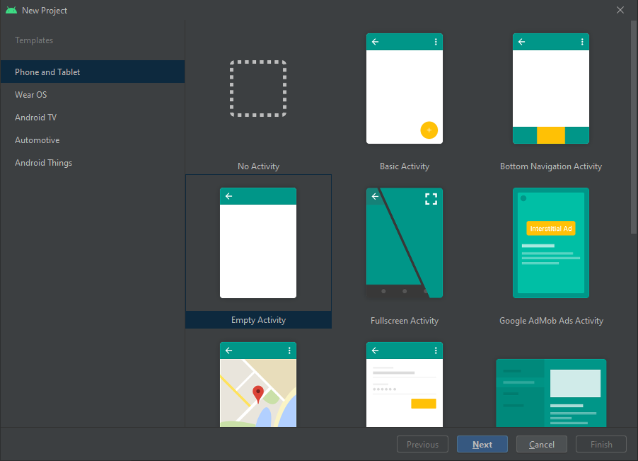
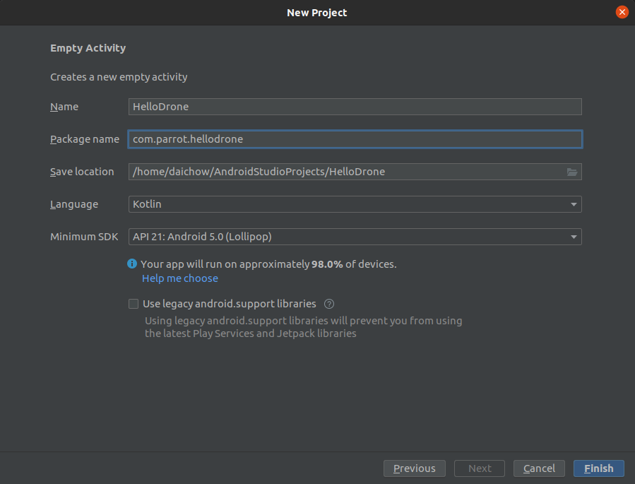
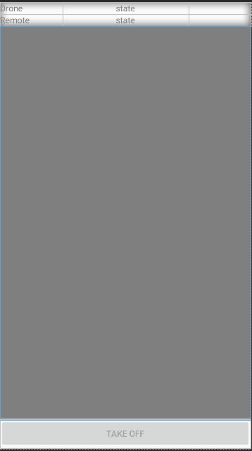

# Creating a Base Drone App

The tutorial below demonstrates how to import the Parrot Ground SDK into a new Android project and implement basic video streaming and flight features (take off and land). Similar steps can be taken for integrating the SDK into an existing application.

## Android Studio Project Setup

Screenshots in this section were generated while using Android Studio 3.0. It is recommended, however to use the latest version of Android Studio.

### Create a New Application

This application will demonstrate how to integrate the Parrot Android SDK into an Android Studio project.

*   Open Android Studio and on the start-up screen select **File -> New Project**

*   In the **New Project** screen:
    *   Set the device to **"Phone and Tablet"**.
    *   Set the template to **"Empty Activity"** and then press **"Next"**.

<p "center">
  
 </p>

*   On the next screen:
    * Set the **Application name** to your desired app name. In this example we will use "ImportSDKDemo".
    * The **Package name** is conventionally set to something like "com.companyName.applicationName". We will use "com.dji.importsdkdemo".
    * Set **Language** to Kotlin
    * Set **Minimum SDK** to API 19: Android 4.4 (KitKat)
    * Do NOT check the option to "Use legacy android.support.libraries"
    * Click **Finish** to create the project.

<p "center">
  
 </p>

### Configure the Gradle Script

Double click on "build.gradle(Module: app)" in the project navigator to open it. Then add the following code to it:

```gradle
apply plugin: 'com.android.application'

apply plugin: 'kotlin-android'

android {
    compileSdkVersion 30
    defaultConfig {
        applicationId "com.parrot.hellodrone"
        // Set the minimum SDK version supported by GroundSdk
        minSdkVersion 24
        targetSdkVersion 30
        versionCode 1
        versionName "1.0"
        testInstrumentationRunner "androidx.test.runner.AndroidJUnitRunner"
    }

    // Add the java 8 compatibility needed by GroundSdk
    compileOptions {
        sourceCompatibility JavaVersion.VERSION_1_8
        targetCompatibility JavaVersion.VERSION_1_8
    }
    kotlinOptions {
        jvmTarget = JavaVersion.VERSION_1_8.toString()
    }

    buildTypes {
        release {
            minifyEnabled false
            proguardFiles getDefaultProguardFile('proguard-android-optimize.txt'), 'proguard-rules.pro'
        }
    }
}

dependencies {
    implementation fileTree(dir: 'libs', include: ['*.jar'])
    implementation 'androidx.appcompat:appcompat:1.2.0'
    implementation 'androidx.core:core-ktx:1.3.2'
    implementation 'androidx.constraintlayout:constraintlayout:2.0.4'
    testImplementation 'junit:junit:4.13'
    androidTestImplementation 'androidx.test:runner:1.3.0'
    androidTestImplementation 'androidx.test.espresso:espresso-core:3.3.0'

    // GroundSdk dependencies
    implementation 'com.parrot.drone.groundsdk:groundsdk:7.0.+'
    runtimeOnly 'com.parrot.drone.groundsdk:arsdkengine:7.0.+'
}
```

Next, double click on the "build.gradle(Project: app)" in the project navigator to open it and replace the contents with the following code:

```gradle
// Top-level build file where you can add configuration options common to all sub-projects/modules.

buildscript {
    ext.kotlin_version = '1.5.31'
    repositories {
        google()
        jcenter()
    }
    dependencies {
        classpath 'com.android.tools.build:gradle:7.0.3'
        classpath "org.jetbrains.kotlin:kotlin-gradle-plugin:$kotlin_version"
        // NOTE: Do not place your application dependencies here; they belong
        // in the individual module build.gradle files
    }
}

allprojects {
    repositories {
        google()
        jcenter()
    }
}

task clean(type: Delete) {
    delete rootProject.buildDir
}
```

Then, finally make sure in your settings.gradle you only have

```gradle
include ':app'
rootProject.name='HelloDrone'
```

Once you finished the steps above, click the "Sync Now" option that pops up. Alternatively, select **File -> Sync Project with Gradle Files** and wait for Gradle project sync to finish.

### Working on the MainActivity

Once we finished the steps above, let's open the "MainActivity.kt" file, and replace the code with the following:. Here we explain the important part of it:

```kotlin
package com.parrot.hellodrone

import androidx.appcompat.app.AppCompatActivity
import android.os.Bundle
import android.widget.Button
import android.widget.TextView
import com.parrot.drone.groundsdk.GroundSdk
import com.parrot.drone.groundsdk.ManagedGroundSdk
import com.parrot.drone.groundsdk.Ref
import com.parrot.drone.groundsdk.device.DeviceState
import com.parrot.drone.groundsdk.device.Drone
import com.parrot.drone.groundsdk.device.RemoteControl
import com.parrot.drone.groundsdk.device.instrument.BatteryInfo
import com.parrot.drone.groundsdk.device.peripheral.StreamServer
import com.parrot.drone.groundsdk.device.peripheral.stream.CameraLive
import com.parrot.drone.groundsdk.device.pilotingitf.Activable
import com.parrot.drone.groundsdk.device.pilotingitf.ManualCopterPilotingItf
import com.parrot.drone.groundsdk.facility.AutoConnection
import com.parrot.drone.groundsdk.stream.GsdkStreamView

class MainActivity : AppCompatActivity() {


    private lateinit var groundSdk: GroundSdk

    private var drone: Drone? = null
    private var droneStateRef: Ref<DeviceState>? = null
    private var droneBatteryInfoRef: Ref<BatteryInfo>? = null
    private var pilotingItfRef: Ref<ManualCopterPilotingItf>? = null
    private var streamServerRef: Ref<StreamServer>? = null
    private var liveStreamRef: Ref<CameraLive>? = null
    private var liveStream: CameraLive? = null
    
    private var rc: RemoteControl? = null
    private var rcStateRef: Ref<DeviceState>? = null
    private var rcBatteryInfoRef: Ref<BatteryInfo>? = null


    private lateinit var streamView: GsdkStreamView
    private lateinit var droneStateTxt: TextView
    private lateinit var droneBatteryTxt: TextView
    private lateinit var rcStateTxt: TextView
    private lateinit var rcBatteryTxt: TextView
    private lateinit var takeOffLandBt: Button

    override fun onCreate(savedInstanceState: Bundle?) {
        super.onCreate(savedInstanceState)
        setContentView(R.layout.activity_main)

        streamView = findViewById(R.id.stream_view)
        droneStateTxt = findViewById(R.id.droneStateTxt)
        droneBatteryTxt = findViewById(R.id.droneBatteryTxt)
        rcStateTxt = findViewById(R.id.rcStateTxt)
        rcBatteryTxt = findViewById(R.id.rcBatteryTxt)
        takeOffLandBt = findViewById(R.id.takeOffLandBt)
        takeOffLandBt.setOnClickListener {onTakeOffLandClick()}

        droneStateTxt.text = DeviceState.ConnectionState.DISCONNECTED.toString()
        rcStateTxt.text = DeviceState.ConnectionState.DISCONNECTED.toString()

        groundSdk = ManagedGroundSdk.obtainSession(this)
    }

    override fun onStart() {
        super.onStart()

        groundSdk.getFacility(AutoConnection::class.java) {

            it?.let{
                if (it.status != AutoConnection.Status.STARTED) {
                    it.start()
                }

                if (drone?.uid != it.drone?.uid) {
                    if(drone != null) {
                        stopDroneMonitors()

                        resetDroneUi()
                    }

                    drone = it.drone
                    if(drone != null) {
                        startDroneMonitors()
                    }
                }

                if (rc?.uid  != it.remoteControl?.uid) {
                    if(rc != null) {
                        stopRcMonitors()

                        resetRcUi()
                    }

                    rc = it.remoteControl
                    if(rc != null) {
                        startRcMonitors()
                    }
                }
            }
        }
    }
    
    private fun resetDroneUi() {
        droneStateTxt.text = DeviceState.ConnectionState.DISCONNECTED.toString()
        droneBatteryTxt.text = ""
        takeOffLandBt.isEnabled = false
        streamView.setStream(null)
    }
    
    private fun startDroneMonitors() {
        monitorDroneState()

        monitorDroneBatteryLevel()

        monitorPilotingInterface()

        startVideoStream()
    }


    private fun stopDroneMonitors() {
        droneStateRef?.close()
        droneStateRef = null

        droneBatteryInfoRef?.close()
        droneBatteryInfoRef = null

        pilotingItfRef?.close()
        pilotingItfRef = null

        liveStreamRef?.close()
        liveStreamRef = null

        streamServerRef?.close()
        streamServerRef = null

        liveStream = null
    }


    private fun startVideoStream() {
        streamServerRef = drone?.getPeripheral(StreamServer::class.java) { streamServer ->
            if (streamServer != null) {
                if(!streamServer.streamingEnabled()) {
                    streamServer.enableStreaming(true)
                }

                if (liveStreamRef == null) {
                    liveStreamRef = streamServer.live { liveStream ->

                        if (liveStream != null) {
                            if (this.liveStream == null) {

                                streamView.setStream(liveStream)
                            }

                            if (liveStream.playState() != CameraLive.PlayState.PLAYING) {
                                liveStream.play()
                            }
                        } else {
                            streamView.setStream(null)
                        }
                        this.liveStream = liveStream
                    }
                }
            } else {
                liveStreamRef?.close()
                liveStreamRef = null
                streamView.setStream(null)
            }
        }
    }


    private fun monitorDroneState() {
        droneStateRef = drone?.getState {

            it?.let {
                droneStateTxt.text = it.connectionState.toString()
            }
        }
    }

    private fun monitorDroneBatteryLevel() {
        droneBatteryInfoRef = drone?.getInstrument(BatteryInfo::class.java) {

            it?.let {
                droneBatteryTxt.text = getString(R.string.percentage, it.batteryLevel)
            }
        }
    }

    private fun monitorPilotingInterface() {
        pilotingItfRef = drone?.getPilotingItf(ManualCopterPilotingItf::class.java) {
            if (it == null) {
                takeOffLandBt.isEnabled = false
            } else {
                managePilotingItfState(it)
            }
        }
    }

    private fun managePilotingItfState(itf: ManualCopterPilotingItf) {
        when(itf.state) {
            Activable.State.UNAVAILABLE -> {
                takeOffLandBt.isEnabled = false
            }

            Activable.State.IDLE -> {
                takeOffLandBt.isEnabled = false

                itf.activate()
            }

            Activable.State.ACTIVE -> {

                when {
                    itf.canTakeOff() -> {
                        takeOffLandBt.isEnabled = true
                        takeOffLandBt.text = getString(R.string.take_off)
                    }
                    itf.canLand() -> {
                        takeOffLandBt.isEnabled = true
                        takeOffLandBt.text = getString(R.string.land)
                    }
                    else -> 
                        takeOffLandBt.isEnabled = false
                }
            }
        }
    }

    private fun onTakeOffLandClick() {
        pilotingItfRef?.get()?.let { itf ->
            if (itf.canTakeOff()) {
                itf.takeOff()
            } else if (itf.canLand()) {
                itf.land()
            }
        }
    }


    private fun resetRcUi() {
        rcStateTxt.text = DeviceState.ConnectionState.DISCONNECTED.toString()
        rcBatteryTxt.text = ""
    }


    private fun startRcMonitors() {
        monitorRcState()

        monitorRcBatteryLevel()
    }


    private fun stopRcMonitors() {

        rcStateRef?.close()
        rcStateRef = null

        rcBatteryInfoRef?.close()
        rcBatteryInfoRef = null
    }


    private fun monitorRcState() {
        rcStateRef = rc?.getState {

            it?.let {
                rcStateTxt.text = it.connectionState.toString()
            }
        }
    }


    private fun monitorRcBatteryLevel() {
        rcBatteryInfoRef = rc?.getInstrument(BatteryInfo::class.java) {

            it?.let {
                rcBatteryTxt.text = getString(R.string.percentage, it.batteryLevel)
            }
        }
    }
}
```

### Implementing the Layout of the MainActivity

Here we will implement the layout of the Main Actvitity. We will be using many built in components and views as well as custom ones from the Ground SDK.

```xml
<?xml version="1.0" encoding="utf-8"?>
<androidx.constraintlayout.widget.ConstraintLayout xmlns:android="http://schemas.android.com/apk/res/android"
        xmlns:app="http://schemas.android.com/apk/res-auto"
        xmlns:tools="http://schemas.android.com/tools"
        android:layout_width="match_parent"
        android:layout_height="match_parent"
        tools:context=".MainActivity">

    <LinearLayout
            android:id="@+id/info"
            android:layout_width="match_parent"
            android:layout_height="wrap_content"
            android:orientation="vertical"
            app:layout_constraintLeft_toLeftOf="parent"
            app:layout_constraintRight_toRightOf="parent"
            app:layout_constraintTop_toTopOf="parent">

        <LinearLayout
                android:layout_width="match_parent"
                android:layout_height="match_parent"
                android:orientation="horizontal">

            <TextView
                    android:id="@+id/labelDroneControl"
                    android:layout_width="0dp"
                    android:layout_height="match_parent"
                    android:layout_weight="1"
                    android:text="Drone"/>

            <TextView
                    android:id="@+id/droneStateTxt"
                    android:layout_width="0dp"
                    android:layout_height="match_parent"
                    android:layout_weight="2"
                    android:text="state"
                    android:textAlignment="center"/>

            <TextView
                    android:id="@+id/droneBatteryTxt"
                    android:layout_width="0dp"
                    android:layout_height="match_parent"
                    android:layout_weight="1"
                    android:text=""
                    android:textAlignment="textEnd"/>
        </LinearLayout>

        <LinearLayout
                android:layout_width="match_parent"
                android:layout_height="match_parent"
                android:orientation="horizontal">

            <TextView
                    android:id="@+id/labelRemoteControl"
                    android:layout_width="0dp"
                    android:layout_height="match_parent"
                    android:layout_weight="1"
                    android:text="Remote"/>

            <TextView
                    android:id="@+id/rcStateTxt"
                    android:layout_width="0dp"
                    android:layout_height="match_parent"
                    android:layout_weight="2"
                    android:text="state"
                    android:textAlignment="center"/>

            <TextView
                    android:id="@+id/rcBatteryTxt"
                    android:layout_width="0dp"
                    android:layout_height="match_parent"
                    android:layout_weight="1"
                    android:text=""
                    android:textAlignment="textEnd"/>
        </LinearLayout>
    </LinearLayout>

    <com.parrot.drone.groundsdk.stream.GsdkStreamView
            android:id="@+id/stream_view"
            android:layout_width="match_parent"
            android:layout_height="0dp"
            app:layout_constraintTop_toBottomOf="@id/info"
            app:layout_constraintBottom_toTopOf="@id/takeOffLandBt"
            tools:layout_editor_absoluteY="38dp">
    </com.parrot.drone.groundsdk.stream.GsdkStreamView>

    <Button
        android:id="@+id/takeOffLandBt"
        android:layout_width="match_parent"
        android:layout_height="wrap_content"
        android:enabled="false"
        android:text="take off"
        app:layout_constraintBottom_toBottomOf="parent" />

</androidx.constraintlayout.widget.ConstraintLayout>
```

Here, your final layout should look like this:
<p align="center">
   
</p>

### Modifying AndroidManifest file

Once you finished the steps above, let's open the "AndroidManifest.xml" file and add the following elements on top of the **application** element:

```xml
<?xml version="1.0" encoding="utf-8"?>
<manifest xmlns:android="http://schemas.android.com/apk/res/android"
    package="com.parrot.hellodrone">

    <application
        android:allowBackup="true"
        android:icon="@mipmap/ic_launcher"
        android:label="@string/app_name"
        android:roundIcon="@mipmap/ic_launcher_round"
        android:supportsRtl="true"
        android:theme="@style/AppTheme">
        <activity android:name="com.parrot.hellodrone.MainActivity">
            <intent-filter>
                <action android:name="android.intent.action.MAIN" />

                <category android:name="android.intent.category.LAUNCHER" />
            </intent-filter>
        </activity>
    </application>

</manifest>
```

The HelloDrone project can now be run. You can download the sample code of this project from this Github repository.

If the App Key was generated correctly and the mobile device has internet connectivity, then the following should be seen:
